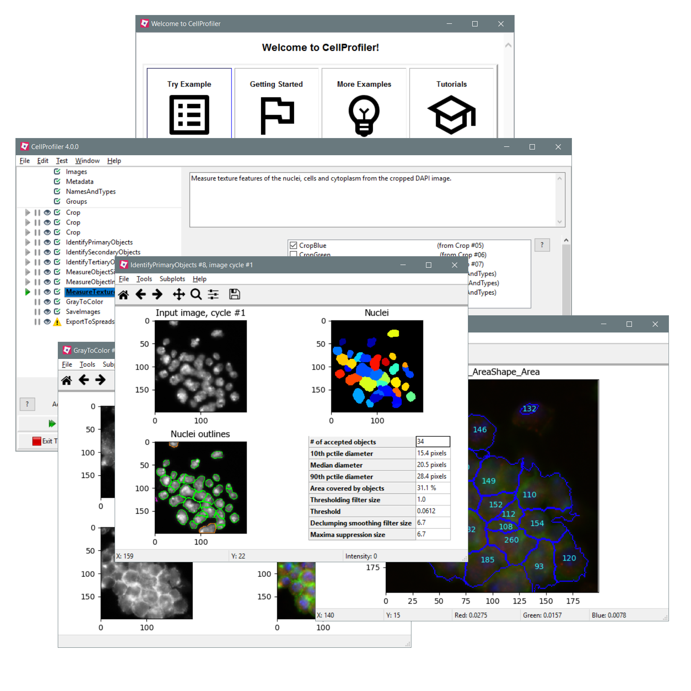

# CellProfiler

 

 
An open-source application designed to automate the quantitative analysis of biological images, 
enabling high-throughput measurement of cell phenotypes through modular pipelines. Its plugin 
architecture and command-line interface support large-scale studies and integration with other 
data analysis workflows.

- Open-source image analysis software for multidimensional imaging data
- Automated end-to-end image analysis pipelines
- Image processing
- 3D Segmentation
- Object Relations
- Image and Object measurements  
 
 

[Official CellProfiler Website](https://cellprofiler.org/) | [GitHub](https://github.com/CellProfiler/CellProfiler)

!!! warning "Citation"
	When using CellProfiler for your image analysis, please cite:
	>***CellProfiler 4: improvements in speed, utility and usability.***  
	Stirling DR, Swain-Bowden MJ, Lucas AM, Carpenter AE, Cimini BA, Goodman A . 
	BMC Bioinformatics (2021)
	
	
### How To Build A Pipeline
A pipeline is a sequential set of image analysis modules. The best way to learn how to use CellProfiler is to load an example pipeline from the CellProfiler website’s Examples page and try it with its included images, then adapt it for your own images. You can also build a pipeline from scratch. Click the Help HelpContent_BuildPipeline_image0 button in the main window to get help for a specific module. 

##### Loading an existing pipeline
1. Put the images and pipeline into a folder on your computer. 
2. Set the Default Output Folder (press the “View output settings”) to the folder where you want to place your output (preferably a different location than in the input images). 
3. Load the pipeline using File ***> Import Pipeline > From File…*** in the main menu of CellProfiler, or drag and drop it to the pipeline window. 
4. Click the Analyze Images button to start processing. 
5. Examine the measurements using Data tools. The Data tools options are accessible in the main menu of CellProfiler and allow you to plot, view, or export your measurements (e.g., to Excel). 
6. Alternately, you can load data into CellProfiler Analyst for more complex analysis. Please refer to its help for instructions. 
7. If you modify the modules or settings in the pipeline, you can save the pipeline using ***File > Export > Pipeline…***. Alternately, you can save the project as a whole using 
***File > Save Project or Save Project As…*** which also saves the file list, i.e., the list of images. 
8. To learn how to use a cluster of computers to process large batches of images, see ***Help > Batch Processing***. 

##### Building a pipeline from scratch
Constructing a pipeline involves placing individual modules into a pipeline. The list of modules in the pipeline is shown in the pipeline panel (located on the left-hand side of the CellProfiler window). 

1. Place analysis modules in a new pipeline. 
Choose image analysis modules to add to your pipeline by clicking the ***Add Help*** button (located underneath the pipeline panel) or 
right-clicking in the pipeline panel itself and selecting a module from the pop-up box that appears. 
You can learn more about each module by clicking Module Help in the “Add modules” window or the ? button after the module has been placed 
and selected in the pipeline. Modules are added to the end of the pipeline or after the currently selected module, but you can adjust their 
rder in the main window by dragging and dropping them, or by selecting a module (or modules, using the Shift key) and using the ***Move Module Up*** and 
***Move Module Down*** buttons. The ***Remove Module*** button will delete the selected module(s) from the pipeline. 
Most pipelines depend on one major step: identifying the objects, (otherwise known as “segmentation”). In CellProfiler, the objects you identify are called primary, secondary, or tertiary: 

* IdentifyPrimary modules identify objects without relying on any information other than a single grayscale input image (e.g., nuclei are typically primary objects). 

* IdentifySecondaryObjects modules require a grayscale image plus an image where primary objects have already been identified, because the secondary objects are determined based on the primary objects (e.g., cells can be secondary objects when their identification is based on the location of nuclei). 

* IdentifyTertiary modules require images in which two sets of objects have already been identified (e.g., nuclei and cell regions are used to define cytoplasm objects, which are tertiary objects). 

2. Adjust the settings in each module. 
In the CellProfiler main window, click a module in the pipeline to see its settings in the settings panel. 
To learn more about the settings for each module, select the module in the pipeline and click the Help button to the right of each setting, 
or at the bottom of the pipeline panel for the help for all the settings for that module. 
If there is an error with the settings (e.g., a setting refers to an image that doesn’t exist yet), a ***X*** icon will appear next to the module name. 
If there is a warning (e.g., a special notification attached to a choice of setting), a ***!*** icon will appear. 
Errors will cause the pipeline to fail upon running, whereas a warning will not. Once the errors/warnings have been resolved, a ***Check box*** icon will appear indicating that the module is ready to run. 

3. Set your Default Output Folder and, if necessary, your Default Input Folder 
Both of these can be set via File > Preferences…. Default Output Folder can be additionally changed by clicking the View output settings button directly below the list of modules in the pipeline; if any modules in your pipeline have referenced the Default Input Folder it will also appear in View output settings. 

4. Click *Analyze images to start processing.* 
All of the images in your selected folder(s) will be analyzed using the modules and settings you have specified. The bottom of the CellProfiler window will show: 

* A ***pause button*** which pauses execution and allows you to subsequently resume the analysis. 

* A ***stop button*** which cancels execution after prompting you for a place to save the measurements collected to that point. 

* A ***progress bar*** which gives the elapsed time and estimates the time remaining to process the full image set. 

At the end of each cycle: 

* If you are using the **ExportToDatabase module**, CellProfiler saves the measurements in the output database. 

* If you are using the **ExportToSpreadsheet module**, CellProfiler saves the measurements into a temporary file; spreadsheets are not written until all modules have been processed. 

5. Click *Start Test Mode to preview results.* 
You can optimize your pipeline by selecting the Test option from the main menu. Test mode allows you to run the pipeline on a selected image, preview the results, and adjust the module settings on the fly. See Help > Testing Your Pipeline for more details. 

6. Save your project (which includes your pipeline) via File > Save Project. 
Saving images in your pipeline: Due to the typically high number of intermediate images produced during processing, images produced during processing are not saved to the hard drive unless you specifically request it, using a SaveImages module. 
Saving data in your pipeline: You can include an Export module to automatically export data in a format you prefer. See Help > Using Your Output for more details.