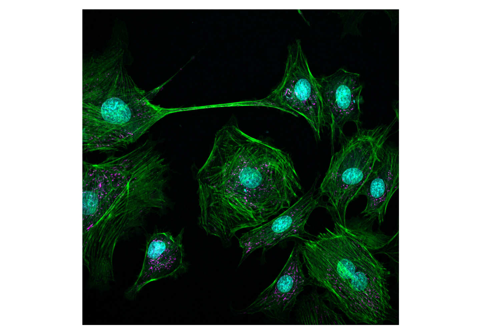
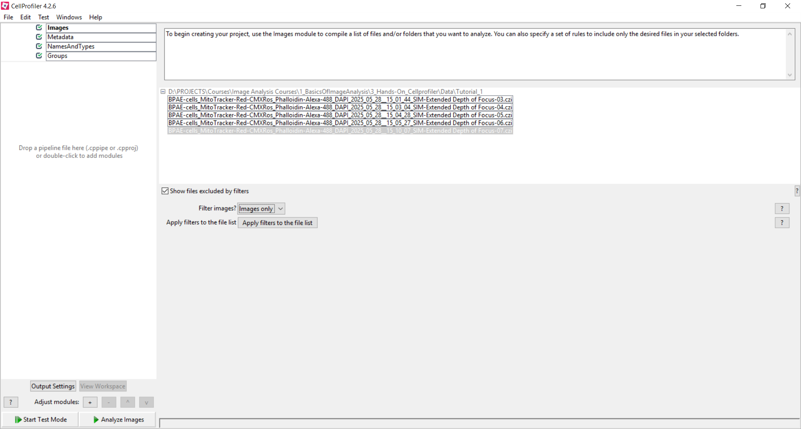
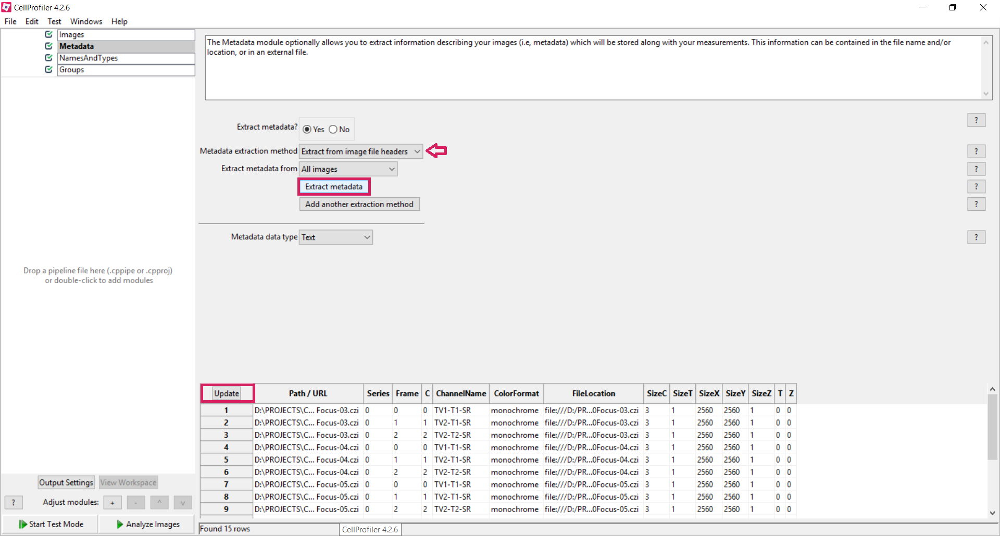
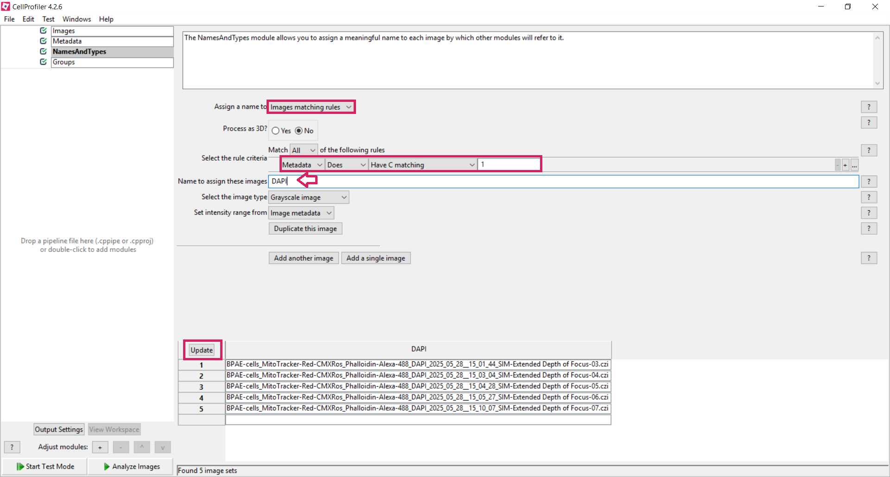
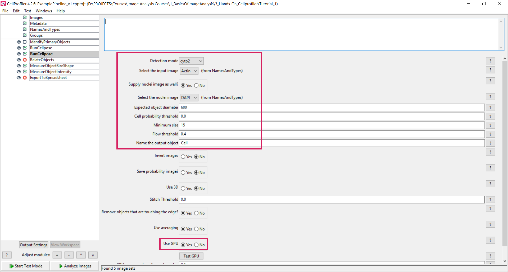

# 🛠 **Hands-On CellProfiler: Creating a Reproducible Analysis Pipeline**

## **Background Scenario**

---

## **Research questions for today**

- **How many cells do we have per field of view?**  
- **What is the mean DAPI intensity among all cells?**  
- **What is the mean area of the nuclei?**

---

## **Analysis strategy**

1. Segment nuclei  
2. Measure the size and shape of the nuclei  
3. Measure the DAPI intensity in the nuclei  
4. Export the measurements  

---

## 🧭 **Step-by-Step Instructions**

## ▶️ **Step 1: Create a new CellProfiler project**
- Click on the **CellProfiler** icon.  
- Create a new CellProfiler project.

---

## ▶️  **Step 2: Load Your Images**

This step defines the raw input images for the pipeline. A reproducible analysis always starts from unchanged raw data stored in a stable and well-organized location.

- Right click on the *Drop field* → **Browse for Folder**  
- Select your dataset directory  

---

## ▶️  **Step 3: Metadata**

The Metadata module extracts experimental identifiers (e.g. channel, well, position) and attaches them to each image. 
Correct metadata is essential to keep images, measurements, and experimental conditions consistently linked.

- In **Metadata**, extract image identifiers:
  - *Extract metadata?*: **Yes**
  - *Metadata extraction method*: **Extract from image file headers**
  - Click **Extract metadata**
  - Click **Update** to populate the table

---

## ▶️  **Step 4: NamesAndTypes**

NamesAndTypes assigns meaningful names to image channels (e.g. “Nuclei” instead of “Channel1”). All downstream modules rely on these names, so incorrect assignments will affect the entire pipeline.

- In **NamesAndTypes**, assign channels:
  - *Assign a name to*: **Images matching rules**
  - Assign **Nuclei** to images containing *channel 1* in their metadata
  - Click **Update** to display the image table

---

## ▶️ **Step 5: Start Test Mode**

**Why this is important:**  
Test Mode allows step-by-step inspection and parameter tuning on a small number of images, which is essential for building a robust and reproducible pipeline.

---

## ▶️  **Step 6: Identify Cells using Cellpose**

RunCellpose performs automated segmentation of nuclei using a deep learning model. Always visually inspect the segmentation results, 
as model performance depends strongly on image quality, contrast, and scale.

- Add a new module by clicking **“+”** under *Adjust modules*  
* Add a **RunCellpose** module

  * Select the appropriate detection mode for cytoplasm
  * You can include the nucleus channels as second channel
  * Select your input image ("Actin")
  * Typical diameter: 50-80 pixels
  * Give a meaningful name to your output object (e.g. "Cytoplasm_Segmentation")
  * Review segmentation overlay and adjust diameter or threshold settings until nuclei are well separated.

- 

---

## ▶️  **Step 7: Identify Nuclei using Cellpose**

- Add a new module by clicking **“+”** under *Adjust modules*  
* Add a **RunCellpose** module

  * Select the appropriate detection mode for nuclei
  * Select your input image ("Nuclei")
  * Typical diameter: 100-400 pixels
  * Give a meaningful name to your output object (e.g. "Nuclei_Segmentation")
  * Review segmentation overlay and adjust diameter or threshold settings until nuclei are well separated.