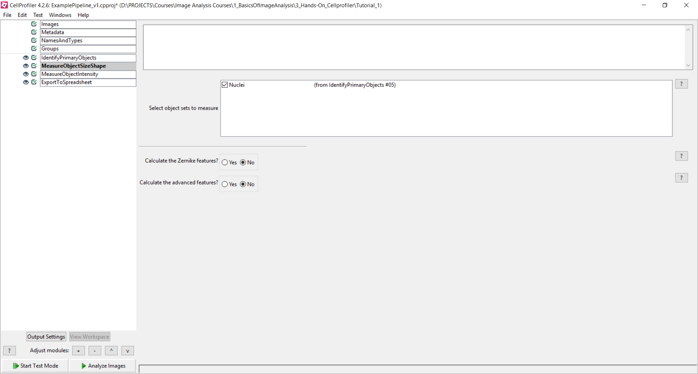
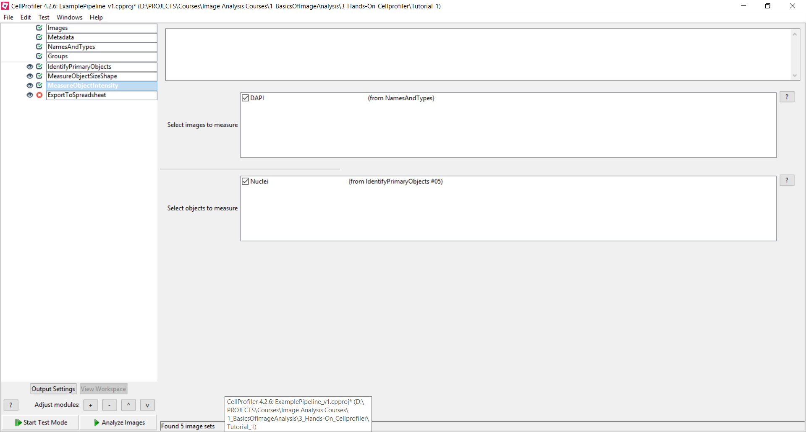
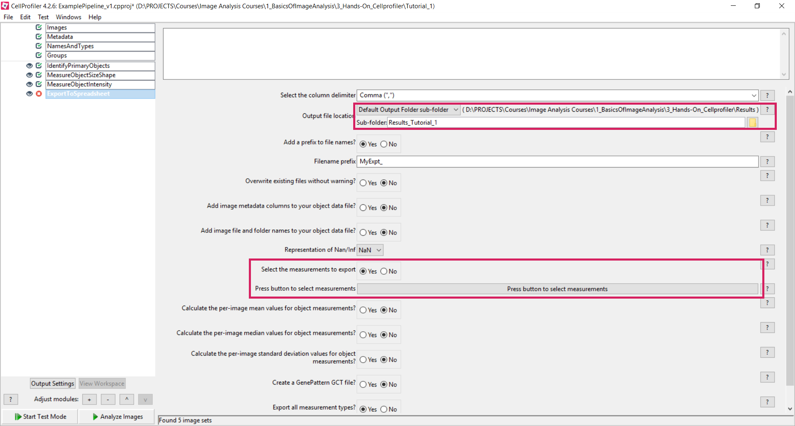
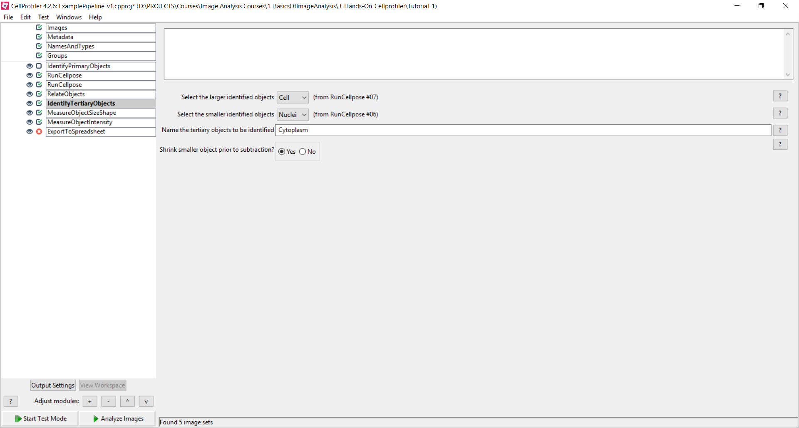

## ⚪ **Step 8: Assign each cytoplasm one nucleus**

Assign each nucleus one cell:

* Add **RelateObjects** to verify each cytoplasm is assigned to its nucleus.
  * Choose "Cytoplasm_Segmentation" as Parent Object and "Nuclei_Segmentation" as Child Objects
  * Save the children with parents as new object set with a meaningful name (e.g. "Nuclei_Seg_Relate")

---

## 📐 **Step 5: MeasureObjectSizeShape**

* Add the **MeasureObjectSizeShape** module.
  * Select the object(s) you want to measure, e.g.: Nuclei_Segmentation

**Module explanation:**  
This module computes morphological features such as area, perimeter, and shape descriptors for each segmented nucleus. Reliable measurements depend directly on accurate object segmentation.

---

## 🔬 **Step 6: MeasureObjectIntensity**

* Add **MeasureObjectIntensity**

  * Measure channel intensity in nuclei objects.
  * You need to select the images that you'd like to measure ("DAPI")
  * You also need to select the objects that you'd like to measure ("Nuclei_Segmentation")

**Module explanation:**  
MeasureObjectIntensity quantifies fluorescence intensity statistics (e.g. mean, sum, maximum) within each nucleus. Ensure the correct intensity image (DAPI channel) is selected to avoid invalid measurements.

---

## 🧮 **Step 7: ExportToSpreadsheet**

* Add **ExportToSpreadsheet**

  * Select measurements: `YAP_TAZ_ratio`, object IDs, metadata
  * Choose CSV output path (e.g., `results/YAP_TAZ_ratios.csv`)
  
* Save your pipeline via **File > Save Project As** (e.g., `measurenuclei_pipeline.cpproj`).

**Module explanation:**  
Exports object- and image-level measurements to CSV files for downstream analysis. Including metadata columns in the export is critical for traceability and reproducibility.

---

## ✅ **Final Reproducibility Check**

Before running **Analysis Mode**, confirm that:
- Segmentation overlays look correct across multiple images  
- Key parameters are documented or saved with the pipeline  

--- 

###### 🧰 **Task:**  
Add another measurement module from the “Measurement” module category and configure it. 
Which modules make sense, which don’t?  
You can find more info on the measurements here: https://cellprofiler-manual.s3.amazonaws.com/CellProfiler-4.2.6/modules/measurement.html

---

###### 🧰 **Task:**  
The cytoplasm segmentation actually includes the nucleus - what would a better approach be?
Can you subtract the nucleus from the cytoplasm? Which module would you choose?
Hint: Create a tertiary object ...

---

### 📌 Key Takeaways

| ✅ Pros                                         | ⚠️ Cons                                                           |
| ---------------------------------------------- | ----------------------------------------------------------------- |
| GUI‑driven, no coding required                 | Initial setup of modules can be time‑intensive                    |
| Fully modular: you see every processing step   | Large pipelines may feel overwhelming at first                    |
| Transparent settings: all parameters are saved | Complex scripts require Python integration                        |
| Batch‑process dozens of images with one click  | Advanced analyses (e.g., machine learning) need plugins or export |

---

### 🔗 Useful Resources

* **CellProfiler Documentation:** [https://cellprofiler.org/manual](https://cellprofiler-manual.s3.amazonaws.com/CellProfiler-4.2.6/index.html)
* **Example Pipelines Gallery:** [https://cellprofiler.org/examples](https://cellprofiler.org/examples)
* **Video Tutorials:** [https://www.youtube.com/CellProfiler](https://www.youtube.com/playlist?list=PLXSm9cHbSZBBy7JkChB32_e3lURUcT3RL)
* **Discussion Forum:** [https://forum.image.sc](https://forum.image.sc)

