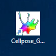

# 🛠️ **Hands-On Cellpose: Segmenting Difficult Cells**

### **Background Scenario**

You're working with fluorescent microscopy images of touching cells. 
You’ve tried conventional thresholding and watershed segmentation in Fiji or ImageJ
— but the cells are touching, boundaries are unclear, and over- or under-segmentation is a 
common issue.

---

### **Goal:** 
Use **Cellpose** to generate accurate cell masks, separating individual cells, 
even in cluttered images. Then use **Fiji** to measurement cell properties.

---
### 5.1 Cellpose Sgmentation

Start Cellpose by clicking on the Cellpose icon on your Desktop.

Your Cellpose GUI should look like this:

---
#### ▶️ Step 1: Load Your Image

* Open your image using `File > Load image (*.tif, *.png, *.jgp)` in the GUI
* Your image should now appear in grayscale or RGB

---

#### ▶️ Step 2: Inspect the Cellpose GUI

You'll find different sections at the left hand side of the Cellpose GUI. 

* **Views** Control of channels, brightness and contrast
* **Drawing**: Selection how to show segmentation and control about manual annotations
* **Segmentation**: Parameters for Cellpose (cyto3) segmentation
* **Other models**: Selection of custom models or other Cellpose models (a.o. nuclei, cyto2)
* **Image restoration**: Performs denoising or filtering before segmentation if enabled
* **Scale disk on**: Size indicator as magenta disk at the lower left side of the image
* You can **Zoom** using the mouse wheel or <kbd>Ctrl</kbd> + <kbd>+</kbd> and <kbd>Ctrl</kbd> + <kbd>-</kbd> 

 

* Toggle the different views and adjust brightness and contrast for your channels.
* Which structures do channel 0 and channel 1 show?

--- 

#### ▶️ Step 3: Apply the pre-trained model (cyto3)

* Set the correct diameter of your cells - you can use a measurement from Fiji, estimate the size using the scale disk or click "Calibrate" to let Cellpose decide
* Select the channels you'd like to segment, "chan2" can be the nuclei channel to support segmentation
* **Flow threshold / cell probability:** Leave default for now
* **Use GPU:** Enable if you have one (optional but faster)

---

#### ▶️ Step 4: Run Segmentation

* Click **“Run cyto3"** or click run next the custom or data-specific models
* You’ll see overlaid segmentation mask
* Use **View** to change the display, e.g. show the segmentation outlines
* Evaluate: 
	* Are all cells segmented? 
	*Are there missed detections or merged objects?
* Compare results between the different **cyto** and **nuclei** models.
* Try adjusting the **diameter** or **flow threshold** — what changes?

---

#### ▶️ Step 5: Refine or Save

* Use the **brush tool** to manually correct any mistakes if needed
* Export masks as:

  * **Label Images**: `File > Save masks as PNG/tif`
  * **ROIs**: `File > Save outlines as .zip archive of ROI files for ImageJ`  

---

#### 🧪 **Challenge Exercise**

Try running Cellpose on:

* A brightfield image of adherent cells
* A DAPI-stained image with clustered nuclei
* A tissue section with mixed cell sizes

---

### 5.2 Training your own Cellpose model

#### ▶️ Step 1: Prepare your training images

* Prepare your data: Place images with a similar style (e.g., similar cell types, consistent normalization) in the same folder.
* Name it "training data"
* Open your first Image

---
#### ▶️ Step 2: Run an initial model

* Run one of the built-in models (e.g., cyto3 or nuclei) that works best as a starting point
* Ensure correct channel selection for your data.

---
#### ▶️ Step 3: Correct the segmentations

* Now you can start to adjust the labels and annotate your data. 

* Use the following short-cuts for deleting and drawing annotations:
	* Add new ROIs by <kbd>right-clicking</kbd>. Right-click once and encircle your cell.
	* Delete incorrect masks by holding <kbd>Ctrl</kbd> and <kbd>left-clicking</kbd> on them.

* The GUI will autosave the manual changes to a _seg.npy file in the same directory.

---
#### ▶️ Step 4: Start the training

* Go to the Models menu in the top bar and select Train new model... (or use <kbd>Ctrl</kbd> + <kbd>T</kbd>).
* Select the pretrained model you used in Step 2 as the starting point.
* Type a name for your new custom model.
* Accept the default parameters, which are usually appropriate.
* Click OK to begin training. 

---
#### ▶️ Step 5: Iterate

* The newly trained model will automatically run on the next image in the folder. 
* You can repeat the correction and retraining steps (3-5) as many times as necessary until you are satisfied with the accuracy. 

---
#### Key considerations:

* **Training Data**: For the best results, all images intended for a single model should be in the same folder. When you retrain, the model uses all the previously labeled images in that folder to avoid "forgetting" earlier annotations.
* **Model Availability**: Your custom-trained model will be available in the GUI under the "custom model" section for future use.
* **Performance**: Retraining with even a small number of labeled images (around 3-5 is often sufficient) can significantly improve performance for your specific data typ

---

#### 🔗 Useful Resources
	
You can watch the tutorials by Carsen Stringer and Marius Pachitariu  on YouTube:

* [cellpose 2.0 tutorial: how to train your own cellular segmentation model](https://www.youtube.com/watch?v=5qANHWoubZU)

* [Cellpose3: one-click image restoration for improved cellular segmentation](https://www.youtube.com/watch?v=TZZZlGk6AKo&t=48s)
	
* [Cellpose-SAM: superhuman generalization for cellular segmentation](https://www.youtube.com/watch?v=KIdYXgQemcI)