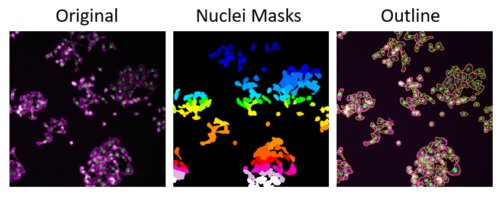

# Cellpose
[Cellpose: a generalist algorithm for cellular segmentation](https://www.nature.com/articles/s41592-020-01018-x) | [GitHub](https://github.com/MouseLand/cellpose)

###### What it Does
Cellpose is a generalist cell segmentation tool designed to work “out of the box” on a wide variety of cell types, imaging modalities, and magnifications.

##### Applications
- Whole‑cell segmentation in fluorescence, brightfield, or phase‑contrast  
- Dense tissue sections with varied cell shapes and sizes  
- High‑throughput screens where manual tuning is impractical  

*The images shows cell segmentation using CellPose, displayed as image mask and outlines.*  
Images were derived from the Broad Bioimage Benchmark Collection (Caicedo et al., Nature Methods, 2019)]

##### Key ideas behind Cellpose

- Cellpose does **not** directly predict cell boundaries
- Instead, it predicts **vector flow fields** that point toward the center of each cell
- Each pixel is assigned:
	- A direction in x
	- A direction in y
	- A probability of belonging to a cell
- Pixels that follow these flows and converge to the same point are grouped into one cell
- Pixels predicted as background are removed to refine cell shapes

This flow-based approach makes Cellpose robust to:

- Touching or overlapping cells
- Irregular cell shapes
- Moderate variations in contrast and staining

##### Cellpose supports a wide range of microscopy data:

- Fluorescence microscopy (nuclei, cytoplasm, membranes)
- Brightfield and phase-contrast images
- Single-channel and multi-channel images
- 2D images and 3D stacks (via slice-wise processing)

##### Important considerations:

- Image scaling and pixel size consistency
- Correct channel assignment
- Image quality strongly influences segmentation results
---

### Evolution of Cellpose (Versions 1.0–4.0)

##### Cellpose 1.0 (2020)
- First generalist Cellpose model
- Trained on a diverse dataset of cell types
- Works “out of the box” for many 2D microscopy images
- Introduced the flow-based segmentation principle

##### Cellpose 2.0 (2022)
- Added **human-in-the-loop training**
- Allows retraining with a small number of annotations
- Introduced a model zoo and improved generalist models
- Lowered the barrier for adapting Cellpose to new datasets

##### Cellpose 3.0 (2023)
- Introduced **image restoration models**
- Supports denoising, deblurring, and upsampling
- Restoration can be combined with segmentation
- Improves robustness on noisy or low-quality images

##### Cellpose 4.0 / CP-SAM (2024–2025)
- Integrates ideas from **foundation models** (Segment Anything Model)
- Designed for improved zero-shot generalization
- Aims to work robustly on previously unseen image domains

---

##### Advantages and Disadvantages
| **Advantages** | **Disadvantages** |
| --------------- |------------------- |
| **Pre-trained on Diverse Data:**   Performs well without additional training on most cell types. | **GPU Recommended:**  Large 3D stacks or high‑resolution images can be slow on CPU. |
| **Automatic Diameter Estimation:**  No need to guess object size—Cellpose infers it from your image. | **Less Accurate on Pure Nuclear Stains:**   May over‑segment clumped nuclei unless you switch to the “nuclei” model. |
| **GUI Support:**  Easy point‑and‑click interface. | |

!!! warning "Citation"
	When using CellPose for your image analysis, please cite:
	>***Cellpose: a generalist algorithm for cellular segmentation.***  
	Stringer, C., Wang, T., Michaelos, M. et al. Nat Methods 18, 100–106 (2021).
	DOI: [https://doi.org/10.1038/s41592-020-01018-x](https://doi.org/10.1038/s41592-020-01018-x)
	
---
