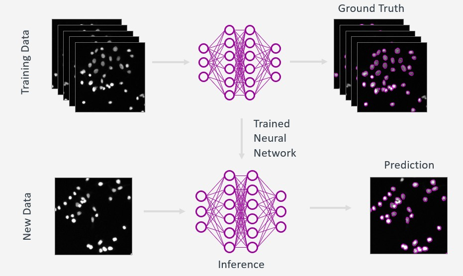

# Deep Learning (DL) in Bioimage Analysis

### 🎯 Learning Objectives

* Explain the basic principles of deep learning–based image segmentation and how it differs from classical segmentation approaches.
* Apply **Cellpose** to segment 2D microscopy images using the GUI and appropriate model and parameter choices.
* Assess segmentation quality by identifying common errors and limitations in Cellpose results.
* Train a custom Cellpose model using the GUI with user-provided annotated data.
* Compare the performance of a custom-trained model to a pre-trained Cellpose model on new images.

---

Deep learning has quickly become a go‑to approach for making sense of complex biological images. 
By “learning” directly from examples, these methods handle challenges like uneven lighting, overlapping cells, 
and noisy backgrounds far better than traditional techniques. Today, you can train a ready‑made model on just a 
few hand‑drawn annotations to get clean segmentation masks, remove background haze, or spot subtle patterns you 
might miss by eye. 

---

### Why Deep Learning for Image Segmentation?

Classical image segmentation methods (thresholding, edge detection, watershed) rely on **hand-crafted rules** and strong assumptions about image quality. While powerful, they often fail when:

- Image contrast varies strongly between datasets
- Objects touch or overlap
- Signal-to-noise ratio is low
- Cell shapes are heterogeneous

Deep learning–based segmentation addresses these limitations by **learning features directly from annotated data**, allowing models to generalize across imaging conditions and biological variability.

---

### Basic principles of DL

Deep learning is a way for computers to learn patterns from examples—no need to hand‑craft rules. Think of it like 
teaching a digital “brain” to recognize structures in images: you feed it lots of example pictures (inputs) along 
with the answers you want (outputs), such as “this is a cell” or “this pixel is background.” The network, made of 
many simple units called neurons organized in layers, adjusts itself during training so that when you show it a new 
image, it can predict the correct labels or segmentation masks on its own.

- A neural network is trained using **input images** and corresponding **ground-truth masks**
- The network learns to associate image patterns with object interiors and boundaries
- During inference, the trained model predicts segmentation results for unseen images

### Key Concepts (Short Definitions)

**Training**  
Process in which a deep learning model learns from annotated images (input images + ground-truth masks) by iteratively adjusting its internal parameters.

**Inference**  
Application of a trained model to new, unseen images to generate segmentation results without requiring annotations.

---

**Generalist model**  
A model trained on diverse datasets to perform reasonably well across many cell types, imaging modalities, and experimental conditions.

**Specialized model**  
A model trained or fine-tuned on a specific dataset or experiment to achieve higher accuracy for a narrow use case.

---

**Training data diversity**  
The range of biological and technical variability represented in the training data (e.g. cell shapes, staining, noise, illumination), which determines how well a model generalizes.

**Annotation quality**  
The accuracy and consistency of ground-truth labels used for training; directly defines what the model learns and strongly impacts segmentation performance.

---

!!! tip "Advantages of Deep Neural Networks for Image segmentation"
	- **Robust Feature Recognition**: 
		Automatically learn complex textures, shapes, and intensity variations that traditional methods can’t capture.
	- **Ready‑to‑Use Models**: 
		Leverage pre‑trained networks to segment common cell types immediately—no training required.
	- **Customizable Accuracy**: 
		Quickly fine‑tune or retrain on your own examples (transfer learning) to adapt the model to new stains, microscopes, or tissues.

---

---

### Importance of Training Data Diversity and Annotation Quality

Deep learning models learn **only from the data they are shown**.  
This has two important consequences:

#### Training Data Diversity
* Models perform best when training data:
	* Covers biological variability (cell size, shape, density)
	* Includes technical variability (illumination, noise, contrast)
* Lack of diversity leads to **poor generalization** on new data

Example: A model trained only on high-contrast images may fail on noisy or dim images

---

#### Annotation Quality
- Ground-truth annotations define what the model considers “correct”
- Inconsistent or inaccurate annotations directly degrade model performance
- Models will **reproduce annotation errors faithfully**

* Common annotation problems:
	- Missing cells
	- Inconsistent boundaries
	- Mixing background artifacts with real objects

**Key takeaway:**  
Garbage in, garbage out applies strongly to deep learning segmentation.

---
