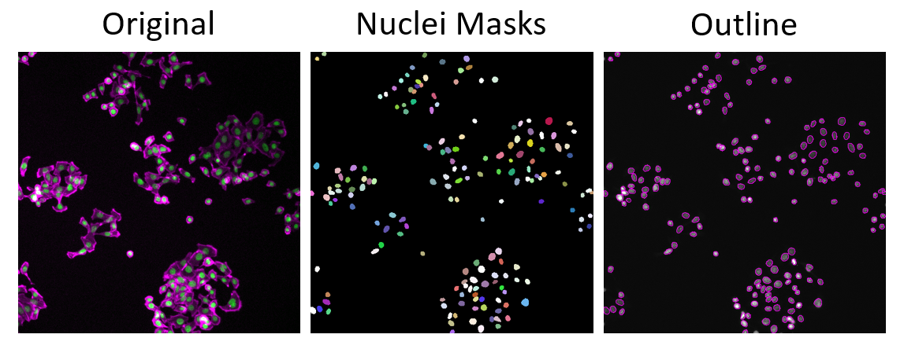

### DL Tools for Cell Segmentation
 
### StarDist
[Cell Detection with Star‑convex Polygons](https://arxiv.org/abs/1806.03535) | [GitHub](https://github.com/stardist/stardist)

###### What it Does
StarDist excels at segmenting round or slightly elongated structures—think nuclei, small spheroids, or yeast cells—by representing each object as a “star” of radial lines from its center.

##### Applications
- Nuclear segmentation in fluorescence images  
- Yeast or bacterial colonies in phase‑contrast  
- Any roughly round objects in 2D or 3D  

*The images shows nuclei segmentation using Stardist, displayed as image mask and outlines.*  
Images were derived from the Broad Bioimage Benchmark Collection (Caicedo et al., Nature Methods, 2019)]

###### How It Works
1. **Probability Map:** Learns a pixel‑wise probability of being part of an object versus background.  
2. **Polygon Prediction:** For each object pixel, predicts distances along evenly spaced rays to the object boundary, 
yielding a star‑convex polygon.  
3. **Mask Generation:** Applies non‑maximum suppression on overlapping polygons to produce separated object masks.  

###### Advantages and Disadvantages
| **Advantages** | **Disadvantages** |
| --------------- |------------------- |
| **Handles Crowding:**   Separates touching nuclei more reliably than simple watershed. | **Shape Restriction:**   Not ideal for highly irregular or filamentous cells (e.g., neurons). |
| **3D‑Ready:**   Directly segments volumetric stacks without needing slice‑by‑slice cleanup. | **Annotation Overhead:** Requires drawing individual object centers if you fine‑tune the model. |

!!! warning "Citation"
	When using Stardist for your image analysis, please cite:
	>***Cell Detection with Star-convex Polygons***  
	Uwe Schmidt, Martin Weigert, Coleman Broaddus, and Gene Myers. International Conference
	on Medical Image Computing and Computer-Assisted Intervention (MICCAI), Granada, Spain, 2018.
	DOI: [https://doi.org/10.48550/arXiv.1806.03535](https://doi.org/10.48550/arXiv.1806.03535)
	

### Further Reading

!!! tip "DL Tools for image analysis"
	You can find more DL Tools for image analysis on our [confluence page](https://confluence.uni-muenster.de/spaces/WWUIMW/pages/67303984/Deep+Learning+Tools+for+Bioimage+Analysis). 
	[Here](https://confluence.uni-muenster.de/spaces/WWUIMW/pages/159191839/Software+for+Deep+Learning+Tools) we summarized the software and tools for DL that are currently available via the MiN.
	
	
	
	