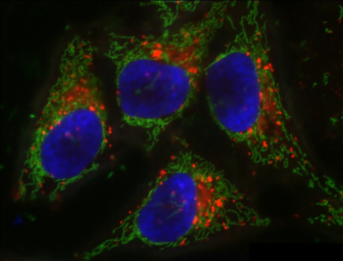
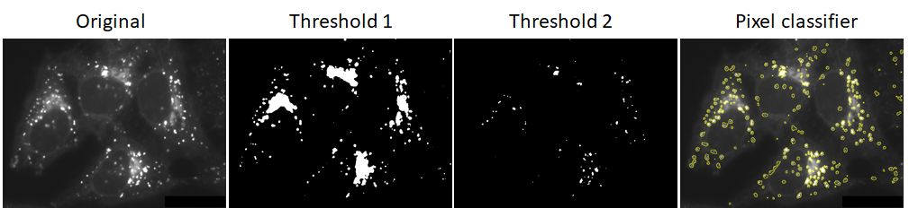
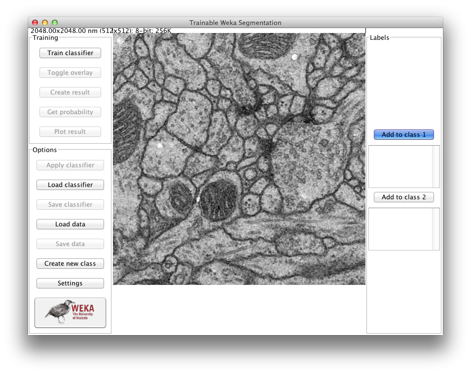
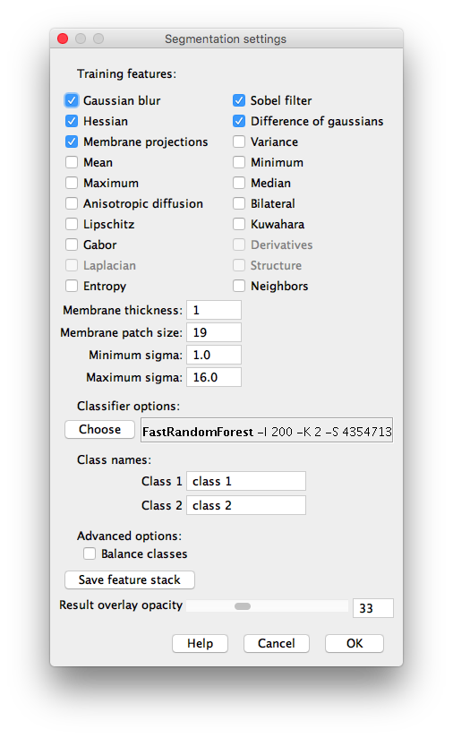
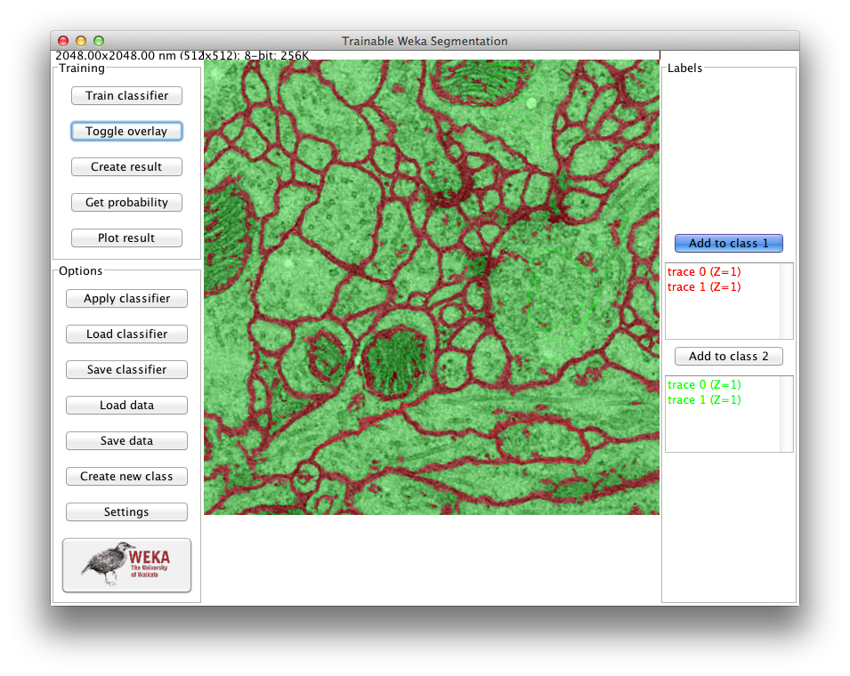

# 🛠️ **Tutorial 4 - Weka:   Segmenting Lysosomes with Pixel Classification**

### Background Scenario

You’ve acquired a fluorescence microscopy image with three channels:

* **Red**: lysosomes
* **Green:** mitochondria
* **Blue:** nuclear stain

  
*Fiji - Sample Image. This is a composite color image of HeLa cells is courtesy of Tony Collins, creator of the ImageJ for Microscopy
collection of plugins at <http://www.macbiophotonics.ca/imagej/>.*

---

### **Goal** 
Segment individual lysosomes from the red channel, even in crowded or noisy areas.

---

### Where Traditional Segmentation Fails

You try global thresholding of the red lysosomes channel:

**Problem:**

  * Merged adjacent lysosomes
  * Faint lysosomes missed entirely
  * Intensity variation and texture not handled

  
*Original: Channel 1 (lysosomes) - in gray scale; Threshold 1: thresholded image with merged objects; Threshold 2: thresholded image with missing objects
Right: ground truth outlines showing individual nuclei*

---

### **Step-by-Step Instructions**

We need a smarter method that considers *context* and *local features* — not just intensity.
Let’s use a **pixel classifier** in Fiji!
To train a pixel classifier we can use the Plugin *Trainable Weka Segmentation*. You can find more information here: https://imagej.net/plugins/tws/

---

#### ▶️ Step 1: Start your project

* Open **Fiji** 
* Open the Hela Cells Sample Image: `File > Open Samples > HeLa Cells (48-bit RGB)`
* Duplicate the lysosome channel (channel 1)
* Go to `Plugins > Segmentation > Trainable Weka Segmentation`

---

#### ▶️ Step 2: Inspect your Image

* Use the **Magnifying glass** to zoom to your structures of interest
* With the **Scrolling Tool** you can pan your image

---

#### ▶️ Step 3: Define Your Classes

* Default Weka shows you two classes - you can create a new class by clicking on `Create new class` on the left hand side of the GUI.
* Go to `Settings` to choose your training features - keep the pre-selected features for now
* Give your classes proper names (e.g. "lysosomes" and "background")
* Select `OK`

---

#### ▶️ Step 4: Annotate Training Regions

* Using the **Line Tool** you can now start annotating your training regions
* Draw a line at your structure of interest and add the label by clicking on `Add to class 1`
* Do the same for the background class
* Cover a variety of image areas:
	* Bright nuclei
	* Dim nuclei
	* Crowded regions
	* Background noise
  
* Label at least 5–10 representative regions per class
* You can use the remove incorrect labels by using `Delete` on your keyboard

---

#### ▶️ Step 6: Train the Classifier

* Click `Train classifier` to train your segmentation algorithm
* After training, weka will show a **probability map** 
* To continue annotating, click `Toggle overlay`

---

#### ▶️ Step 7: Refine Annotations

* If the classifier is making mistakes:
	- Add or erase brush strokes
	- Focus on misclassified edge areas or noisy zones
* Click `Train classifier` to train your segmentation algorithm again and inspect the results.

---

#### ▶️ Step 8: Export your Result

* You can export your segmentation by clicking on `Create result` or export the probability map by clicking `Get probability`
* How does the output between **result** and **probability** differ?
* How would you use the different outputs in your analysis workflow?

---

#### ▶️ Step 9: Batch Apply to New Images

*If we had any more images ...*  

- You can apply your classifier to more images: `Apply classifier`
- You can also save your classifier and data including annotations for later: `Save classifier`

---

### 📌 **Key Takeaways**

| ✅ **Pros**                                  | ⚠️ **Cons**                                               |
| ------------------------------------------- | --------------------------------------------------------- |
| No coding or machine learning knowledge needed | Initial manual labeling takes time                        |
| Learns from pixel patterns & textures       | Classifier might need tuning per dataset                  |
| Great for complex or noisy images           | Semantic segmentation
| Fast batch processing after training        | Watershed post-processing sometimes required              |

---

### 🔗 **Resources & Downloads**

For a detailed recap of the demonstration of the Pixel Classification Workflow using Weka, 
please visit the [Trainable Weka Segmentation page](https://imagej.net/plugins/tws/).

---

!!! warning "Citation"
	When using **Trainable Weka Segmentation** for your image analysis, please cite:
	>**Trainable Weka Segmentation: a machine learning tool for microscopy pixel classification.**  
	Arganda-Carreras, I., Kaynig, V., Rueden, C., Eliceiri, K. W., Schindelin, J., Cardona, A., & Sebastian Seung, H., Bioinformatics (2017). 
	  DOI: [doi:10.1093/bioinformatics/btx180](10.1093/bioinformatics/btx180)