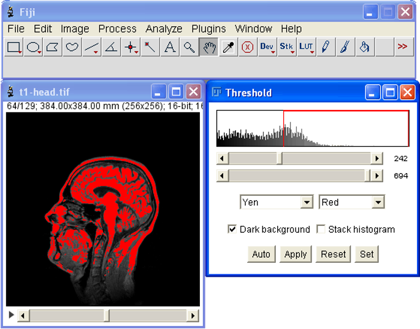

## 🛠 Tutorial 3: Analyse Your Images

### 🎯 Learning Objective

- Combine Fiji’s core tools to preprocess images, segment relevant structures, and extract measurements from your data.

--- 

###3.1. Simple Thresholding

- **Thresholding**:
`Image > Adjust > Threshold...`
Converts a grayscale image into a binary image (black and white) by separating pixels into foreground (objects) and background based on their intensity.

*Image segmentation to obtain information about the intranuclear structures such as size and change, structure count as well as the intensity of cells and nuclei.*  

!!! tip "Exercise"
    - Open the image you would like to segment.
	- Duplicate your Image `Ctrl + Shift + D`.
    - Go to `Image > Adjust > Threshold...`
    - Manually select a threshold that segments your image best.
	- Try the Autothresholds - what differences do they show?
	- When you are sastified with your segmentation click `Apply`. 

---

###3.2. Cleaning the Mess - Image filters

- **Subtract Background / Denoise:**
    * `Process > Subtract Background...`: Corrects for uneven illumination.
    * `Process > Noise > Denoise...` or `Process > Filters > Gaussian Blur...`: Reduces random noise, making subsequent steps more reliable.
- **Median Filter:**
    * `Process > Filters > Median...`: Effective for removing salt-and-pepper noise while preserving edges better than a simple blur.

!!! tip "Exercise"
    - Use *Subtract Background* or different filters (Mean, Median, Gaussian Blur) to clean up the image
	- How does the filter size influence the result?
	- Does filtering improve the segmentation?

---

###3.3. Refine your Detections

- **Binary Operations:**
    * `Process > Binary > Options...` (then `Close-`, `Open-`, `Fill Holes`, `Erode`, `Dilate`): Refine binary images. For example, `Close-` (dilate then erode) can fill small holes within objects and smooth their outlines.
- **Watershed Segmentation:**
    * `Process > Binary > Watershed`: Separates touching objects in a binary image, often used after thresholding when objects are clumped together.
- **Advanced Watershed Segmentation:**
	* `Plugins > Biovoxxel > Watershed Irregular Features`
	* Here you have more features to finetune your watershed, such as Erosion Cycle Number - Convexity threshold 
	* [BioVoxxel Documentation](https://imagej.net/plugins/biovoxxel-toolbox#watershed-irregular-features)

!!! tip "Exercise"
    - Use *Watershed* to improve your segmentation.
	- What are the limitations of the watershed algorithm?

---

###3.4. Analyse your Images

- **Measurements in Fiji:**
	*`Analyse > Set Measurements`
	* You can select a couple of different measurements for size (area, perimeter), shape (Ferrets diameter, shape descriptors) and intensities (mean, min, max, integrated density)
	* [A detailed description of all measurements can be found here](https://imagej.net/ij/docs/menus/analyze.html)

- **ROI Manager:**
	*  `Analyze > Tools > ROI Manager...`: You can manage multiple ROIs using the ROI manager.
	* Having your ROI selected, press `t` to add it to the ROI manager.

- **Analyze Particles:**
    * `Analyze > Analyze Particles...`: Measures properties (area, shape descriptors, etc.) of objects in a thresholded binary image and can generate ROIs for each identified particle.

!!! tip "Exercise"
    - Open the ROI manager. 
	- Set the measurements you'd like measure.
	- Analyse your data using *Analyse Particles*. Select *Add to Manager* in the *Analyse Particles Window* to display the ROIs in the ROI manager.
	- Why is it wise to use *Exclude on Edges*?
	- Inspect both the resulting ROIs in the ROI manager as well as the measurements in the Results table.
