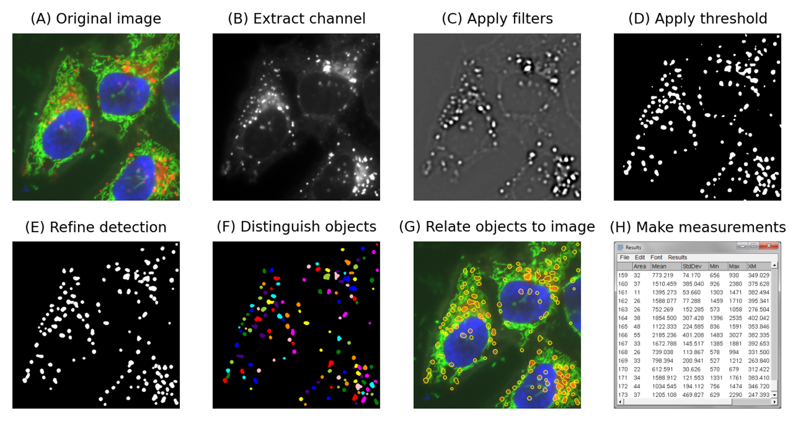
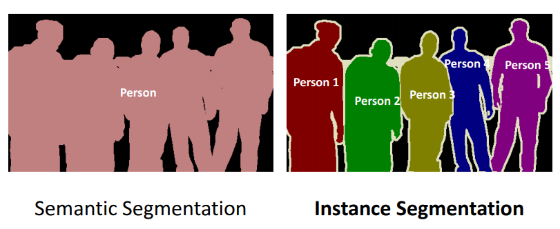
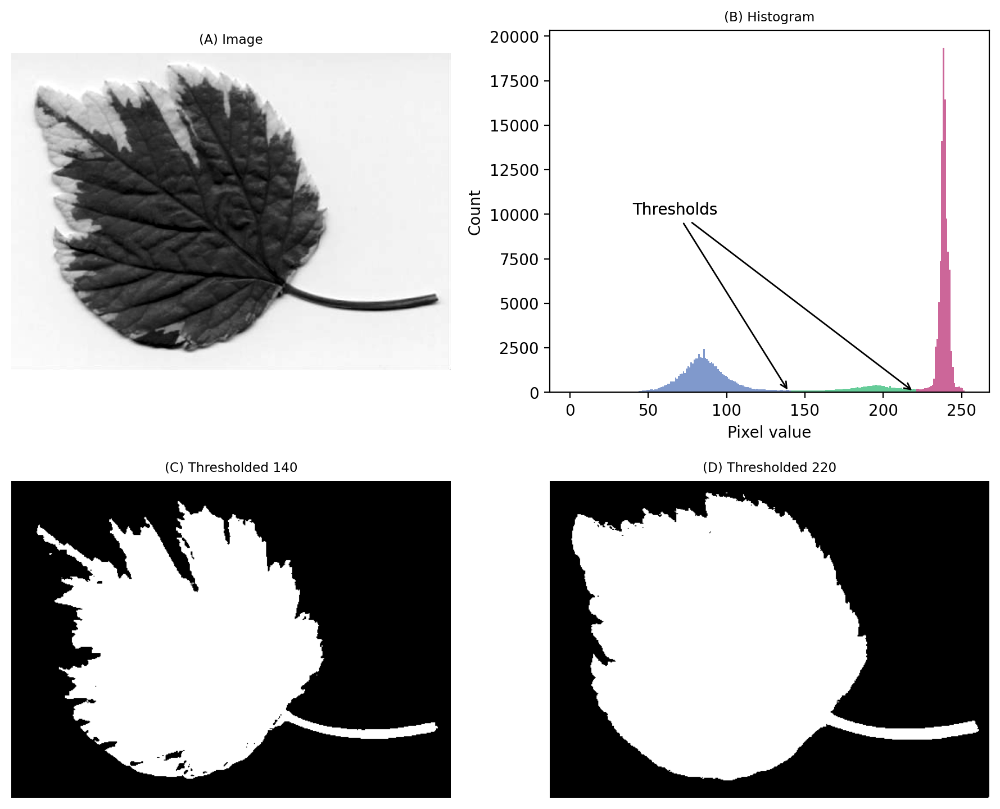

## The Image Analysis Workflow: A Path to Results

### 🎯 Learning Objectives

By the end of this module, you will be able to:

1. Understand and apply the typical steps of an image analysis workflow to transform raw microscopy data into meaningful quantitative results. 
2. Combine Fiji’s core tools to preprocess images, segment relevant structures, and extract measurements from your data.

---

An image analysis workflow is a sequence of operations that transforms your raw image into quantitative results. While there are often several ways to reach your goal, a typical workflow involves:

1. **Preprocessing** is all about improving image quality so that the relevant features are easier to detect. This might include subtracting background signal, correcting uneven illumination, 
or filtering out noise. The output is another image—one that’s cleaner and clearer.

2. **Segmentation** comes next. This is where we teach the computer to identify the objects we care about—cells, nuclei, vesicles, or any other structures—by separating them from the background. Segmentation turns an image into regions or labels that represent meaningful biological entities.

3. **Measurement** is the final step. Once objects are identified, we can quantify them: count how many there are, measure their size, shape, or intensity, or track how they change over time. This is where images become data—and where biological insights emerge.

Each of these steps can be seen as a small piece of a larger puzzle. There is rarely one “correct” workflow, and creative thinking is often needed to find a 
combination of steps that works best for a particular experiment or image type. The art of image analysis lies in selecting and optimizing these steps to reliably extract the information you need from your images.
The **goal** is not just to make nice-looking images, but to make measurements that are accurate, reproducible, and meaningful in the biological context.

*Image segmentation to obtain information about the intranuclear structures such as size and change, 
structure count as well as the intensity of cells and nuclei.*  

---

### The workflow in Fiji

In Fiji, it’s essential to work on a duplicate of your image because Fiji performs most processing steps directly on the image, without keeping a record of each action. 
Unlike workflow-based tools such as CellProfiler or Arivis, Fiji follows a manual, step-by-step approach, where every operation immediately alters the pixel values. 
Duplicating your image before processing protects your original data, allowing you to try different filters or thresholds without losing the raw information. 
It also ensures that any measurements—such as intensity or area—are made on the unaltered image, preserving accuracy and preventing artifacts introduced by image processing from influencing your results.

!!! success "The Core Strategy"
    A common and powerful strategy is:
    > 1. **Duplicate** your original image.
    > 2. **Process and tweak** this duplicate extensively to clearly define the structures you're interested in.
    > 3. Generate **Regions of Interest (ROIs)** based on these defined structures.
    > 4. Apply these ROIs back to the **original, unprocessed image**.
    > 5. Perform **measurements** (e.g., intensity, area, shape) within these ROIs on the original data. This ensures your measurements reflect the true signal without processing artifacts.
	
!!! tip "Work on a Duplicate!"
    Always perform processing steps on a **duplicate** of your original image. This preserves your raw data, allowing you to revisit it or try different processing strategies. The final Regions of Interest (ROIs) generated from the processed image can then be applied back to the original, unaltered image for accurate measurements (e.g., intensity).

---

### Image Segmentation

##### What is Image Segmentation?

Image segmentation refers to the process of partitioning or dividing an image into different regions or components. 
This is typically done to extract relevant information from an image, such as the identification and analysis of specific structures 
or features, such as individual cells or subcellular structures.
In biomedical research, segmentation lets you automatically isolate features like neurons in brain tissue, mitochondria in live-cell 
assays, or cancer cell clusters in histological sections. By converting raw pixel data into discrete objects, 
you can quantify critical metrics—size, shape, intensity, spatial distribution, and colocalization—at scale and with 
reproducibility. These quantitative readouts form the foundation for rigorous analyses of cellular behavior, tissue architecture, 
and disease progression, turning complex images into actionable biological insights. Furthermore, segmented objects can serve as the 
basis for downstream workflows such as time‑lapse tracking, colocalization studies, spatial pattern analysis, and modeling of 
cellular interactions.
 
 

*Image segmentation to obtain information about the intranuclear structures such as size and change, structure count as well as the intensity of cells and nuclei.*  

---

##### What Makes a Good Segmentation?

How to assess your segmentation—visually and practically:

- **Overlay and Inspect:**  
Always check your segmentation masks overlaid on the original image. Do the outlines match the visible objects?
 
 
- **Consistent Across the Dataset:**  
Your segmentation should work not just for one perfect field of view, but across all images—bright, dim, noisy, or clean.
 
 
- **One Object = One Mask:**  
Each biological object (e.g., cell, nucleus) should be represented by a single, well-defined segment—no splitting or merging.
 
 
- **Minimal False Positives and Negatives:**  
	Watch out for:
	- Masks in background areas (false positives)
	- Missed objects that should be detected (false negatives)
 
 
- **Biologically Plausible Shapes and Sizes:**  
Segmented objects should look like real cells—not blobs, fragments, or spaghetti. Are shapes and sizes in line with expectations?
 
 
- **Check Edge Cases:**  
Test the segmentation on challenging examples:
	- Low contrast areas
	- Touching or overlapping objects
	- Varying brightness or background
 
 
- **Compare Across Conditions:**  
Ensure that the same segmentation settings (or model) work equally well for all your experimental conditions and replicates.
 
 
- **Manual Spot Check:**  
Manually review a few segmented objects in each condition. Do they make sense biologically?
 
 
- **Know Your Biological Question:**  
A “perfect” segmentation isn't always needed—only as good as required to extract the features you care about (e.g., intensity, count, shape).

---

##### Semantic vs. Instance Segmentation
Semantic segmentation assigns a class label to every pixel in an image—e.g., “nucleus,” “cytoplasm,” or “background” — 
but does not distinguish between multiple objects of the same class. In contrast, instance segmentation not only classifies each 
pixel but also separates each individual object, giving each cell or organelle its own unique identifier (e.g., “nucleus #1,” 
“nucleus #2,” etc.). In bioimage analysis, semantic segmentation might tell you where all mitochondria are in a tissue section, 
whereas instance segmentation would allow you to count and measure each mitochondrion individually, enabling per-object statistics 
and more detailed single‑cell or subcellular analyses.
 
 

*Principle of semantic and instance segmentation.*  

---

##### Image Segmentation using Thresholding
Traditional segmentation methods use hand‑crafted, rule‑based workflows that distinguish objects from background by leveraging simple 
image features such as intensity, texture, or edge information. Common techniques include global or adaptive thresholding, where pixels above 
a chosen brightness cutoff are labeled as “foreground,” edge‑detection filters that trace object boundaries, and region‑growing 
algorithms that expand from seed points. For instance, you might set an intensity threshold to isolate fluorescently labeled nuclei, 
then apply a watershed transform to delineate touching cells. 
 
 

*An image where evaluating the histogram suggests two candidate thresholds. The ‘correct’ threshold depends upon the desired outcome.* 
*Note that here we identify pixels below the threshold value, rather than above, because the background is ligher.*  
***By Pete Bankhead © Copyright 2022-2024. Derived from https://bioimagebook.github.io/***   

---

### Cleaning the Mess – Image Filters

Before we can measure or segment structures in an image, we need to make sure the image is clean. Real microscopy images often contain noise (random intensity variations) and uneven background (illumination differences). These can interfere with thresholding and segmentation.
- Background subtraction removes large-scale intensity variations, ensuring that the background is evenly dark and objects are consistently bright.
- Noise filters like Median or Gaussian blur reduce random noise.
	- The Median filter replaces each pixel with the median of its neighbors — it removes small bright or dark spots while keeping edges sharp.
	- The Gaussian blur smooths intensity changes, which can make boundaries less sharp but helps to suppress high-frequency noise.

Choosing the right filter and size is important:
Too small — noise remains; too large — fine details disappear.
Clean images lead to better, more reliable segmentation results.

--- 

### Refine Detections - Watershed Segmentation

When objects in a binary image touch each other, they may appear as a single merged region after thresholding. **Watershed segmentation** helps to separate these touching objects.

The algorithm treats the image like a topographic map:

- Bright areas represent “mountains” (object centers),
- Dark areas represent “valleys” (borders).

It simulates water filling from each “mountain” until the water from different regions meets at a “ridge” — that ridge becomes the border between objects.

**Limitations**:
If the image is noisy or objects are not well separated, the watershed can over-segment (too many regions) or under-segment (still merged objects). Pre-processing with smoothing or distance maps can improve results.

--- 
### Analyse Your Data

Once you have segmented and identified your objects, you can measure their properties. 
However, the thresholded binary image only contains object shapes — not the original intensity information.

If you want to measure intensity-based properties (like mean fluorescence inside each nucleus), you should redirect measurements to the original grayscale image. 
- In the Set Measurements dialog, check Redirect to: and select your original image.

This tells Fiji to use the object outlines from the binary image but read the intensity values from the original image — ensuring your measurements reflect the true signal, not the processed binary mask.