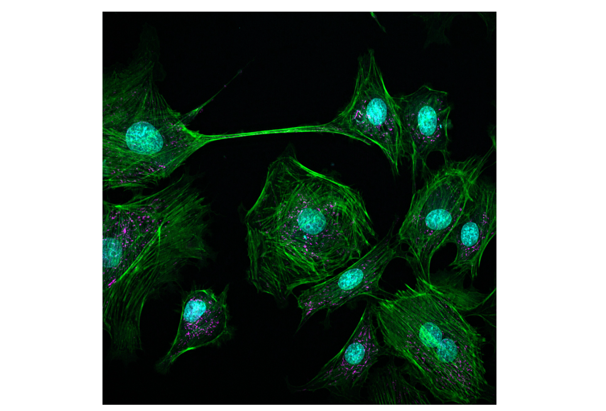

# 🛠️ **Hands-On Cellpose: Segmenting Difficult Cells**

### **Background Scenario**

You're working with fluorescent microscopy images of touching cells. 
You’ve tried conventional thresholding and watershed segmentation in Fiji or ImageJ
— but the cells are touching, boundaries are unclear, and over- or under-segmentation is a 
common issue.



---

### **Goal:** 
Use **Cellpose** to generate accurate cell masks, separating individual cells, 
even in cluttered images.

---

### 🧭 **Step-by-Step Instructions**

You can work on the [JupyterHub](https://jupyterhub.uni-muenster.de/) and start Cellpose by clicking on the Cellpose icon.

Alternatively, you can start Cellpose on the HIVE using the Anaconda Prompt and type:
```bash
conda activate cellpose
cellpose
``` 
---
#### 📂 Step 1: Load Your Image

* Open your image using **File > Open** in the GUI
* Your image should now appear in grayscale or RGB

---

#### 🧠 Step 2: Choose a Pre-Trained Model

- **Model type:** Choose between:
	- **cyto** – for whole-cell segmentation (typical for cytoplasm or membrane-stained images)
	- **nuclei** – for nuclear staining (e.g., DAPI) 
- **Flow threshold / cell probability:** Leave default for now
- **Use GPU:** Enable if you have one (optional but faster)

---

#### 📐 Step 3: Set Diameter (Optional)

* Cellpose can automatically estimate object size
* If the automatic result looks off, set a rough **diameter (in pixels)** manually (try 30–50 px to start)

---

#### ▶️ Step 4: Run Segmentation

* Click **“Run segmentation”**
* You’ll see overlaid cell outlines and a segmentation mask
* Evaluate: Are all cells segmented? Are there missed detections or merged objects?
* Compare results between the different **cyto** and **nuclei** models.
* Try adjusting the **diameter** or **flow threshold**—what changes?

---

#### ✏️ Step 5: Refine or Save

* Use the **brush tool** to manually correct any mistakes if needed
* Export masks as:

  * **Masks** (as image)
  * **Outlines**
  * **CSV** with shape properties
* Save your segmented image using **File > Save**

---

### 🧪 **Challenge Exercise**

Try running Cellpose on:

* A brightfield image of adherent cells
* A DAPI-stained image with clustered nuclei
* A tissue section with mixed cell sizes

---

### 📌 **Key Takeaways**

| Pros                       | Cons                                      |
| -------------------------- | ----------------------------------------- |
| Works “out of the box”     | Needs GPU for large images or 3D stacks   |
| Handles crowded cells well | Not ideal for thin, filamentous shapes    |
| Supports brightfield & RGB | May need tuning for unusual imaging types |
| No coding required         | Fine-tuning model requires annotation     |

---

### 🔗 Useful Resources

* [Official Cellpose Tutorial (YouTube)](https://www.youtube.com/watch?v=K1o2YzEYrRc)
* [Cellpose GitHub Page](https://github.com/MouseLand/cellpose)
