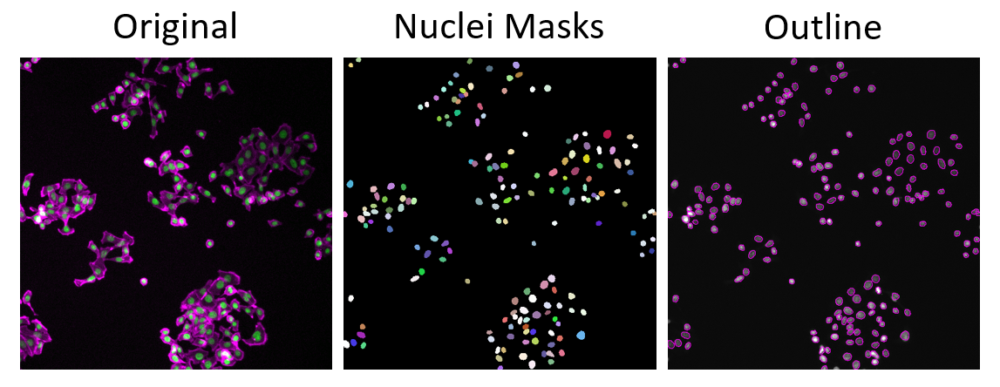
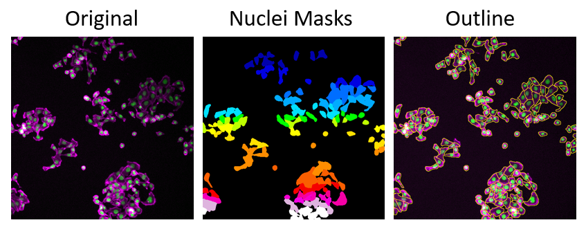

# Deep Learning (DL) in Bioimage Analysis

Deep learning has quickly become a go‑to approach for making sense of complex biological images. 
By “learning” directly from examples, these methods handle challenges like uneven lighting, overlapping cells, 
and noisy backgrounds far better than traditional techniques. Today, you can train a ready‑made model on just a 
few hand‑drawn annotations to get clean segmentation masks, remove background haze, or spot subtle patterns you 
might miss by eye. In this tutorial, we’ll explore two beginner‑friendly tools — StarDist and Cellpose — that let you 
harness deep learning’s power without writing a single line of code.

---

### Basic principles of DL

Deep learning is a way for computers to learn patterns from examples—no need to hand‑craft rules. Think of it like 
teaching a digital “brain” to recognize structures in images: you feed it lots of example pictures (inputs) along 
with the answers you want (outputs), such as “this is a cell” or “this pixel is background.” The network, made of 
many simple units called neurons organized in layers, adjusts itself during training so that when you show it a new 
image, it can predict the correct labels or segmentation masks on its own.

---

### What You Need for Image Segmentation
- **Example Images with Annotations**:
	You only need a handful (dozens, not thousands) of images where you’ve roughly painted regions for “cell” and “background.” These examples teach the model what features matter.

- **Feature‑Finding Networks (CNNs)**:
	Convolutional Neural Networks automatically learn to spot edges, textures, and shapes at different scales—things that are tedious or impossible to define by hand.

- **Shape‑Aware Architectures (e.g., U‑Net)**::
	U‑Net adds a “zooming out” path to capture context and a matching “zooming in” path to recover fine details. This lets the model both see the big picture (where cells sit) and the small picture (precise boundaries).

- **Iterative Training & Refinement**:
	You train the network, inspect its output, then add or correct a few annotations. After a quick retrain, the predictions usually improve dramatically—no need for perfect drawing up front.

!!! tip "Advantages of Deep Neural Networks for Image segmentation"
	- **Robust Feature Recognition**: 
		Automatically learn complex textures, shapes, and intensity variations that traditional methods can’t capture.
	- **Ready‑to‑Use Models**: 
		Leverage pre‑trained networks to segment common cell types immediately—no training required.
	- **Customizable Accuracy**: 
		Quickly fine‑tune or retrain on your own examples (transfer learning) to adapt the model to new stains, microscopes, or tissues.

---

### DL Tools for Cell Segmentation

**StarDist** and **Cellose** are two popular deep learning models for image segmentation that work very well on various image data. 

### StarDist
[Cell Detection with Star‑convex Polygons](https://arxiv.org/abs/1806.03535) | [GitHub](https://github.com/stardist/stardist)

###### What it Does
StarDist excels at segmenting round or slightly elongated structures—think nuclei, small spheroids, or yeast cells—by representing each object as a “star” of radial lines from its center.

##### Applications
- Nuclear segmentation in fluorescence images  
- Yeast or bacterial colonies in phase‑contrast  
- Any roughly round objects in 2D or 3D  

*The images shows nuclei segmentation using Stardist, displayed as image mask and outlines.*  
Images were derived from the Broad Bioimage Benchmark Collection (Caicedo et al., Nature Methods, 2019)]

###### How It Works
1. **Probability Map:** Learns a pixel‑wise probability of being part of an object versus background.  
2. **Polygon Prediction:** For each object pixel, predicts distances along evenly spaced rays to the object boundary, 
yielding a star‑convex polygon.  
3. **Mask Generation:** Applies non‑maximum suppression on overlapping polygons to produce separated object masks.  

###### Advantages and Disadvantages
| **Advantages** | **Disadvantages** |
| --------------- |------------------- |
| **Handles Crowding:**   Separates touching nuclei more reliably than simple watershed. | **Shape Restriction:**   Not ideal for highly irregular or filamentous cells (e.g., neurons). |
| **3D‑Ready:**   Directly segments volumetric stacks without needing slice‑by‑slice cleanup. | **Annotation Overhead:** Requires drawing individual object centers if you fine‑tune the model. |

!!! warning "Citation"
	When using Stardist for your image analysis, please cite:
	>***Cell Detection with Star-convex Polygons***  
	Uwe Schmidt, Martin Weigert, Coleman Broaddus, and Gene Myers. International Conference
	on Medical Image Computing and Computer-Assisted Intervention (MICCAI), Granada, Spain, 2018.
	DOI: [https://doi.org/10.48550/arXiv.1806.03535](https://doi.org/10.48550/arXiv.1806.03535)
	
---

### Cellpose
[Cellpose: a generalist algorithm for cellular segmentation](https://www.nature.com/articles/s41592-020-01018-x) | [GitHub](https://github.com/MouseLand/cellpose)

###### What it Does
Cellpose is a generalist cell segmentation tool designed to work “out of the box” on a wide variety of cell types, imaging modalities, and magnifications.

##### Applications
- Whole‑cell segmentation in fluorescence, brightfield, or phase‑contrast  
- Dense tissue sections with varied cell shapes and sizes  
- High‑throughput screens where manual tuning is impractical  

*The images shows cell segmentation using CellPose, displayed as image mask and outlines.*  
Images were derived from the Broad Bioimage Benchmark Collection (Caicedo et al., Nature Methods, 2019)]

###### How It Works
1. **Flow Field Prediction:** Learns a vector field where each pixel “flows” toward its cell center, naturally separating touching cells.  
2. **Cell Probability Map:** Predicts the likelihood that each pixel belongs to any cell.  
3. **Mask Extraction:** Integrates the flow field to define individual cell masks.  

###### Advantages and Disadvantages
| **Advantages** | **Disadvantages** |
| --------------- |------------------- |
| **Pre-trained on Diverse Data:**   Performs well without additional training on most cell types. | **GPU Recommended:**  Large 3D stacks or high‑resolution images can be slow on CPU. |
| **Automatic Diameter Estimation:**  No need to guess object size—Cellpose infers it from your image. | **Less Accurate on Pure Nuclear Stains:**   May over‑segment clumped nuclei unless you switch to the “nuclei” model. |
| **GUI Support:**  Easy point‑and‑click interface. | |

!!! warning "Citation"
	When using CellPose for your image analysis, please cite:
	>***Cellpose: a generalist algorithm for cellular segmentation. ***  
	Stringer, C., Wang, T., Michaelos, M. et al. Nat Methods 18, 100–106 (2021).
	DOI: [https://doi.org/10.1038/s41592-020-01018-x](https://doi.org/10.1038/s41592-020-01018-x)
	
---

### Further Reading

!!! tip "DL Tools for image analysis"
	You can find more DL Tools for image analysis on our [confluence page](https://confluence.uni-muenster.de/spaces/WWUIMW/pages/67303984/Deep+Learning+Tools+for+Bioimage+Analysis). 
	[Here](https://confluence.uni-muenster.de/spaces/WWUIMW/pages/159191839/Software+for+Deep+Learning+Tools) we summarized the software and tools for DL that are currently available via the MiN.
	
	
	
	