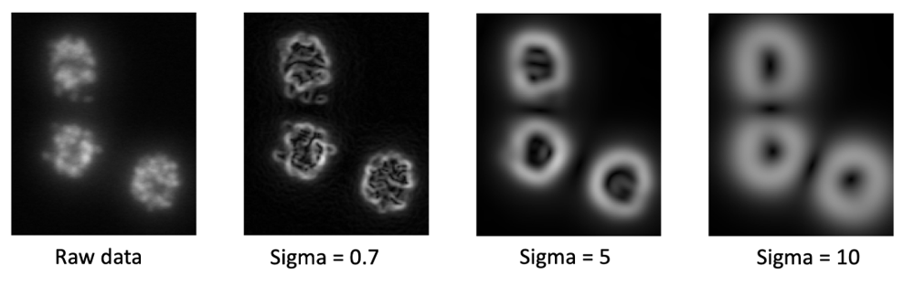
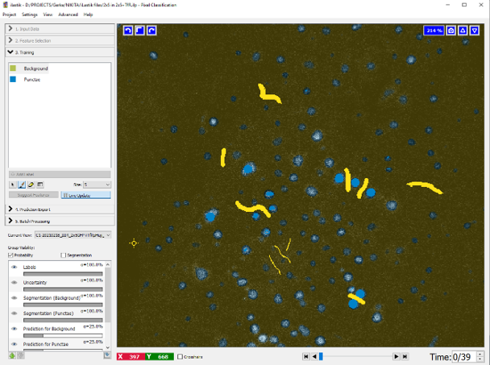

# Best Practices for Pixel Classification

During our hands-on session, we will walk through the complete pixel classification workflow using Ilastik. 
Together, we’ll apply this method to tackle a challenging segmentation task where traditional thresholding fails. 
First, we’ll explore the range of **features** Ilastik offers and cover a few **practical tips for drawing effective annotations**. 
Then, we’ll proceed through the full workflow: creating training annotations, 
selecting meaningful image features, and iteratively refining the model. By the end, you’ll know how to build a pixel classifier 
that can accurately segment your images and scale across large datasets with minimal manual effort.

---

### Selection of Features
Ilastik offers three main feature types, each available in 2D or 3D and at multiple scales:  

- **Color/Intensity:**  
		 Use when your objects differ in brightness or hue from the background.

- **Edge:**  
		Detects sharp changes in intensity or color—ideal for highlighting borders and contours.

- **Texture:**  
		 Captures local patterns (e.g., granularity or striations) when your objects have a distinctive texture.

Each feature can be computed at various scales, defined by a Gaussian smoothing sigma.

- **Low sigma - small neighborhood:** preserves fine details, detecting tiny edges or texture.

- **High sigma - large neighborhood:** emphasizes broader structures and smooths out noise.

The following image shows an example of the edge filter computed with three different sigma values. Note how the filter 
 detects the smallest edges at very low sigma values and only captures the rough cell outlines at high sigma values.

  
*The image shows the edge feature with different sigma values.*
**© Copyright by the ilastik developers** |
[Source](https://www.ilastik.org/license)

!!! tip "Selection of **good** features"
	As a general guideline, we recommend starting by selecting a broad range of feature types 
	and scales. For smaller 2D datasets where computational resources are not a limitation, 
	you can even choose to select all options. After confirming your selections in the feature 
	selection dialog, you can review the chosen features in the bottom-left panel. 
	Usually, you can quickly see by eye if the feature "makes sense" for your data.
	If you are unsure - Ilastik can suggest features for you. Please follow the offical documentation [here](https://www.ilastik.org/documentation/pixelclassification/pixelclassification#suggest).

---

###  Training your Pixel Classifier 

This training process involves a repetitive cycle of human input and machine learning. 
The user starts by creating initial annotations, which are then used to generate predictive 
models. The user evaluates these predictions, identifies areas for improvement, 
and adds additional annotations to correct any mistakes, thereby refining the model's 
performance through multiple iterations.

   
*The image is showing the iterative training process in ilastik. By evaluating the prediction, the user can add targeted annotations to improve the model.* 

!!! tip "How to draw **good** annotations"
	
	- The more features, the more annotations
	- Focus on edges and borders
	- Try to draw background and foreground annotations close to each other
	- Training time depends on number of training samples (e.g. annotated pixels)
	- Adding lot of very similar “looking” pixels will not improve the classifier
	- Include variations on your dataset into the training set (e.g. WT vs mutants, treatments)
