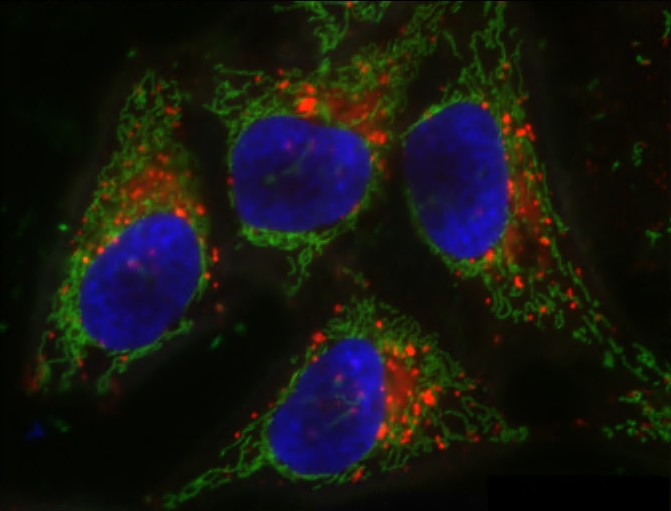
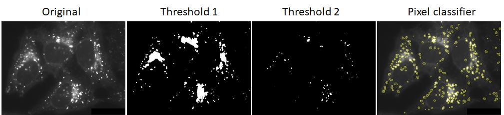

# 🛠️ **Hands-on ilastik:   Segmenting Lysosomes with Pixel Classification**

### Background Scenario

You’ve acquired a fluorescence microscopy image with three channels:

* **Red**: lysosomes
* **Green:** mitochondria
* **Blue:** nuclear stain

  
*Fiji - Sample Image. This is a composite color image of HeLa cells is courtesy of Tony Collins, creator of the ImageJ for Microscopy
collection of plugins at <http://www.macbiophotonics.ca/imagej/>.*

---

### **Goal:** 
Segment individual lysosomes from the red channel, even in crowded or noisy areas.

---

### Where Traditional Segmentation Fails

You try global thresholding of the red lysosomes channel:

**Problem:**

  * Merged adjacent lysosomes
  * Faint lysosomes missed entirely
  * Intensity variation and texture not handled

  
*Original: Channel 1 (lysosomes) - in gray scale; Threshold 1: thresholded image with merged objects; Threshold 2: thresholded image with missing objects
Right: ground truth outlines showing individual nuclei*

---

### 🧭 **Step-by-Step Instructions**

We need a smarter method that considers *context* and *local features* — not just intensity.
Let’s use a **pixel classifier** in ilastik!
You can work on the [JupyterHub](https://jupyterhub.uni-muenster.de/) and start ilastik by clicking on the ilastik icon.
Alternatively, you can start ilastik v1.4 on the HIVE. 

---

#### 📁 Step 1: Start a New Project

* Open **ilastik** 
* Select the **Pixel Classification** workflow
* Create a new project and name it meaningfully (e.g., `lysosome_segmentation.ilp`)

---

#### 🖼️ Step 2: Import Your Image

* Go to **Input Data > Add New > Add separate Image(s)**
* Load your image (red channel only)
* Preview it in the image viewer to ensure it loads correctly

---

#### 🧪 Step 3: Select Features

* Navigate to the **Feature Selection** tab and **Select Features...*
* ilastik will compute image features like:

  * Color/Intensity
  * Edge
  * Texture
* Choose multiple (or all) feature scales (σ values).
  Example: `0.3`, `1.0`, `3.5`, `5.0`
* These help the classifier distinguish fine vs. coarse structures.

---

#### 🏷️ Step 4: Define Classes

* Go to the **Training** Tab
* Add two classes:
	- **Class 1**: *Lysosomes*
	- **Class 2**: *Background*
* You can rename classes by double-clicking their labels

---

#### ✍️ Step 5: Annotate Training Regions

* Use the **paintbrush** tool to label regions for each class
* Cover a variety of image areas:

  * Bright nuclei
  * Dim nuclei
  * Crowded regions
  * Background noise
* Label at least 5–10 representative regions per class
* You can use the **eraser** tool to correct your annotation

!!!tip "Navigating ilastik"
	Go to **Settings** --> **Keyboard Shortcuts**  
	Check out the shortcuts for quick adjustment of image contrast, zoom in/out, panning and navigation between images.

---

#### 🔄 Step 6: Train the Classifier

* Activate **Live Update** (top left of viewer)
* ilastik will update a **probability map** in real time
* Bright areas = high likelihood of being “lysosomes”
* Familiarize yourself with the different visibility options by enabling the **eye ball** icon.
* What does *Labels*, *Uncertainty*, *Segmentation* and *Prediction* show?

---

#### 🧹 Step 7: Refine Annotations

* If the classifier is making mistakes:
	- Add or erase brush strokes
	- Focus on misclassified edge areas or noisy zones
* Live Update helps you immediately see the effect of changes

---

#### 💾 Step 8: Export the Probability Map

* Go to the **Prediction Export** tab
* Choose what to export:

	- Raw probability map (for post-processing in Fiji/ImageJ)
	- Binary segmentation mask

---

#### 🔁 Step 9: Batch Apply to New Images

*If we had any more images ...*  

- In **Batch Input**, load additional images
- ilastik will apply your trained classifier across the entire set
- Great for high-throughput image analysis

---

### 📌 **Key Takeaways**

| ✅ **Pros**                                  | ⚠️ **Cons**                                               |
| ------------------------------------------- | --------------------------------------------------------- |
| No coding or machine learning knowledge needed | Initial manual labeling takes time                        |
| Learns from pixel patterns & textures       | Classifier might need tuning per dataset                  |
| Great for complex or noisy images           | Semantic segmentation
| Fast batch processing after training        | Watershed post-processing sometimes required              |

---

### 🔗 **Resources & Downloads**

For a detailed recap of the demonstration of the Pixel Classification Workflow in ilastik, 
please visit the [Ilastik page](https://www.ilastik.org/documentation/pixelclassification/pixelclassification).

* [ilastik Homepage](https://www.ilastik.org/)
* [Video Tutorials](https://www.youtube.com/@ilastik)
* [Documentation](https://www.ilastik.org/documentation/pixelclassification/pixelclassification)
---

!!! warning "Citation"
	When using Ilastik for your image analysis, please cite:
	>***ilastik: interactive machine learning for (bio)image analysis***  
	Stuart Berg, Dominik Kutra, Thorben Kroeger, Christoph N. Straehle, Bernhard X. Kausler, Carsten Haubold, 
	Martin Schiegg, Janez Ales, Thorsten Beier, Markus Rudy, Kemal Eren, Jaime I Cervantes, Buote Xu, Fynn Beuttenmueller, Adrian Wolny, Chong Zhang, Ullrich Koethe, Fred A. Hamprecht & Anna Kreshuk
	in: Nature Methods, (2019) 
	  DOI: [10.1038/s41592-019-0582-9](10.1038/s41592-019-0582-9)
