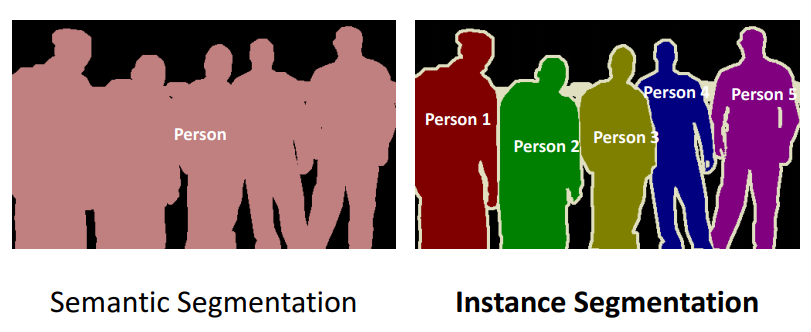

# Basics of Image Segmentation

### 🎯 Learning Objectives

By the end of this module, you will be able to:

1. **Define image segmentation and its importance in bioimage analysis:**  
Explain the concept of image segmentation, its applications, and its role in extracting meaningful information 
from biological images.
2. **Understand the principles of machine learning and deep learning for image segmentation:** 
Describe how machine learning and deep learning can be applied to image segmentation, 
including the basic concepts of supervised learning, pixel classification and convolutional neural networks (CNNs).
3. **Apply AI tools for image segmentation:**  
You will gain practical experience with ML and DL tools, including navigating the user interfaces, loading and processing images, and adjusting algorithm parameters.
Use tools such as Ilastik, Stardist, and Cellpose to segment biological images and evaluate the results.

---

### What is Image Segmentation?

Image segmentation refers to the process of partitioning or dividing an image into different regions or components. 
This is typically done to extract relevant information from an image, such as the identification and analysis of specific structures 
or features, such as individual cells or subcellular structures.
In biomedical research, segmentation lets you automatically isolate features like neurons in brain tissue, mitochondria in live-cell 
assays, or cancer cell clusters in histological sections. By converting raw pixel data into discrete objects, 
you can quantify critical metrics—size, shape, intensity, spatial distribution, and colocalization—at scale and with 
reproducibility. These quantitative readouts form the foundation for rigorous analyses of cellular behavior, tissue architecture, 
and disease progression, turning complex images into actionable biological insights. Furthermore, segmented objects can serve as the 
basis for downstream workflows such as time‑lapse tracking, colocalization studies, spatial pattern analysis, and modeling of 
cellular interactions.
 
 

*Image segmentation to obtain information about the intranuclear structures such as size and change, 
structure count as well as the intensity of cells and nuclei.*  

---
### What Makes a Good Segmentation?

How to assess your segmentation—visually and practically
- Overlay and Inspect: Always check your segmentation masks overlaid on the original image. Do the outlines match the visible objects?
-  Consistent Across the Dataset: Your segmentation should work not just for one perfect field of view, but across all images—bright, dim, noisy, or clean.
- One Object = One Mask: Each biological object (e.g., cell, nucleus) should be represented by a single, well-defined segment—no splitting or merging.
- Minimal False Positives and Negatives:Watch out for:
	- Masks in background areas (false positives)
	- Missed objects that should be detected (false negatives)
- Biologically Plausible Shapes and Sizes: Segmented objects should look like real cells—not blobs, fragments, or spaghetti. Are shapes and sizes in line with expectations?
- Check Edge Cases: Test the segmentation on challenging examples:
	- Low contrast areas
	- Touching or overlapping objects
	- Varying brightness or background
- Compare Across Conditions: Ensure that the same segmentation settings (or model) work equally well for all your experimental conditions and replicates.
- Manual Spot Check: Manually review a few segmented objects in each condition. Do they make sense biologically?
- Know Your Biological Question: A “perfect” segmentation isn't always needed—only as good as required to extract the features you care about (e.g., intensity, count, shape).

---

### Semantic vs. Instance Segmentation
Semantic segmentation assigns a class label to every pixel in an image—e.g., “nucleus,” “cytoplasm,” or “background” — 
but does not distinguish between multiple objects of the same class. In contrast, instance segmentation not only classifies each 
pixel but also separates each individual object, giving each cell or organelle its own unique identifier (e.g., “nucleus #1,” 
“nucleus #2,” etc.). In bioimage analysis, semantic segmentation might tell you where all mitochondria are in a tissue section, 
whereas instance segmentation would allow you to count and measure each mitochondrion individually, enabling per-object statistics 
and more detailed single‑cell or subcellular analyses.
 
 

*Principle of semantic and instance segmentation.*  

---

### Image Segmentation before AI
Traditional segmentation methods use hand‑crafted, rule‑based workflows that distinguish objects from background by leveraging simple 
image features such as intensity, texture, or edge information. Common techniques include global or adaptive thresholding, where pixels above 
a chosen brightness cutoff are labeled as “foreground,” edge‑detection filters that trace object boundaries, and region‑growing 
algorithms that expand from seed points. For instance, you might set an intensity threshold to isolate fluorescently labeled nuclei, 
then apply a watershed transform to delineate touching cells. 
 
 

*An image where evaluating the histogram suggests two candidate thresholds. The ‘correct’ threshold depends upon the desired outcome.* 
*Note that here we identify pixels below the threshold value, rather than above, because the background is ligher.*  
***By Pete Bankhead © Copyright 2022-2024. Derived from https://bioimagebook.github.io/***   

---

### Limitations of Traditional Segmentation Approaches
While these approaches can work well on clean, uniform datasets, they demand meticulous parameter tuning—threshold values and 
filter sizes- and often need to be re‑optimized for each new experimental condition. That manual calibration 
becomes especially burdensome when images exhibit variable staining, uneven illumination, overlapping structures, high levels of 
noise, or intrinsic biological variability, leading to incomplete or inaccurate segmentations. This is where machine‑learning– and 
deep‑learning–based methods step in. By learning patterns and relationships directly from annotated datasets, tools like Ilastik, 
Cellpose, and Stardist can automatically identify and delineate cells, nuclei, and subcellular structures even in challenging images. 
In the next section, we’ll explore how these advanced techniques work and how to apply them effectively for robust bioimage 
segmentation.