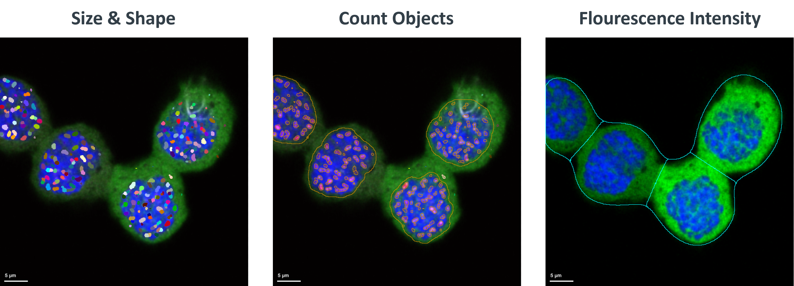
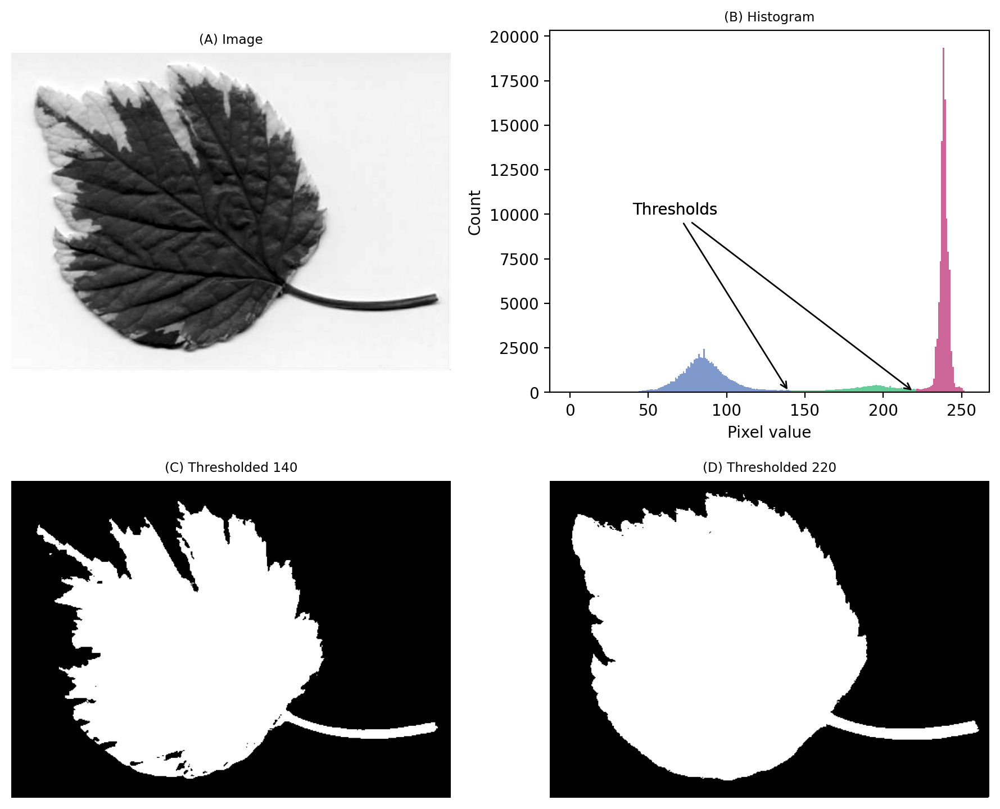

### Image Segmentation

Image segmentation refers to the process of partitioning or dividing an image into different regions or components. 
This is typically done to extract relevant information from an image, such as the identification and analysis of specific structures or features.
In the context of biological imaging, this typically means identifying and isolating specific cells or organelles within an image. 
Image segmentation is useful because it enables researchers to extract meaningful information from images, such as object size, shape, location, 
and distribution, which can be used to understand biological processes and phenomena.
 
 

*Image segmentation to obtain information about the intranuclear structures such as size and change, 
structure count as well as the intensity of cells and nuclei.*  
 
 
Traditional approaches to image segmentation rely on manually defining rules-based algorithms that separate objects from the background based on 
their intensity, texture, or other visual characteristics. These algorithms often involve techniques such as thresholding, edge detection, and 
region growing. For example, a researcher might use thresholding to separate cells from the background by setting a minimum intensity value, above 
which pixels are considered part of a cell. While these traditional approaches can be effective, they often require careful tuning of parameters and 
can be time-consuming to optimize, especially when dealing with complex or heterogeneous images.
 
 

*An image where evaluating the histogram suggests two candidate thresholds. The ‘correct’ threshold depends upon the desired outcome.* 
*Note that here we identify pixels below the threshold value, rather than above, because the background is ligher.*  
***By Pete Bankhead © Copyright 2022-2024. Derived from https://bioimagebook.github.io/***   
 
 
Moreover, traditional approaches may struggle with images that exhibit high levels of noise, variability, or ambiguity, leading to incomplete or inaccurate 
segmentations. This is where more advanced techniques, such as machine learning-based approaches, come into play. By leveraging patterns and 
relationships learned from large datasets, machine learning algorithms can automatically identify and segment objects of interest, even in challenging images. 
In the next section, we will explore some of these advanced techniques, including Ilastik, Cellpose, and Stardist, and how they can be applied to improve 
image segmentation in bioimage analysis.

### Learning Objectives

By the end of this module, you will be able to:

1. ***Define image segmentation and its importance in bioimage analysis:***  
Explain the concept of image segmentation, its applications, and its role in extracting meaningful information 
from biological images.
2. ***Understand the principles of machine learning and deep learning for image segmentation:*** 
Describe how machine learning and deep learning can be applied to image segmentation, including the concepts of supervised learning, convolutional neural networks (CNNs), and semantic segmentation.
Apply AI tools for image segmentation: Use tools such as Ilastik, Stardist, and Cellpose to segment biological images, including:
3. You will gain ***practical experience with ML and DL tools***, including navigating the user interfaces, loading and processing images, and adjusting algorithm parameters.
You will apply these tools to segment sample biological images and evaluate the results.