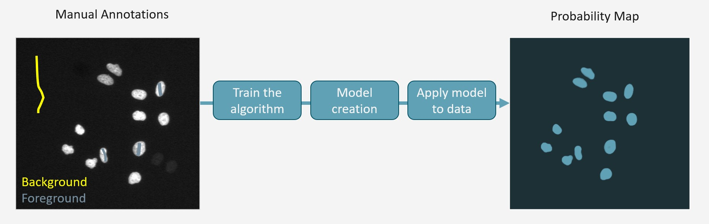

# Pixel Classification

### Introduction
Pixel classification is a key step in image segmentation, where pixels are assigned to different categories or classes 
based on their spatial, textural, or color properties. A pixel classifier is an algorithm that automates this process 
by analyzing the image pixels and determining their class membership. The core concept behind pixel classification 
involves the identification of patterns, similarities, and differences among pixels within an image. 

### Selection of Features
tba

### Training your Pixel classifier

The first step is to train your pixel classifier by drawing annotations of your selected classes and background.

!!! info
	
	- The more features, the more annotations
	- Focus on edges and borders
	- Try to draw background and foreground annotations close to each other
	- Training time depends on number of training samples (e.g. annotated pixels)
	- Adding lot of very similar “looking” pixels will not improve the classifier
	- Include variations on your dataset into the training set (e.g. WT vs mutants, treatments)

### Tools for Pixel Classification

- [Ilastik](https://www.ilastik.org)
- [Trainable Weka Segmentation in Fiji](https://imagej.net/plugins/tws/)
- Machine Learning Segmenter in Arivis

### Ilastik
User-friendly tool for machine learning–based segmentation, classification, and tracking without programming. 
Offers an interactive GUI to train models on pixel and object features for rapid analysis. 
[GitHub Repository](https://github.com/ilastik/ilastik)

When using Ilastik for your image analysis, please cite:

>***ilastik: interactive machine learning for (bio)image analysis***  
Stuart Berg, Dominik Kutra, Thorben Kroeger, Christoph N. Straehle, Bernhard X. Kausler, Carsten Haubold, 
Martin Schiegg, Janez Ales, Thorsten Beier, Markus Rudy, Kemal Eren, Jaime I Cervantes, Buote Xu, Fynn Beuttenmueller, Adrian Wolny, Chong Zhang, Ullrich Koethe, Fred A. Hamprecht & Anna Kreshuk
in: Nature Methods, (2019)

### Ilastik - Pixel Classification Tutorial
https://www.ilastik.org/documentation/basics/dataselection
https://www.ilastik.org/documentation/pixelclassification/pixelclassification
