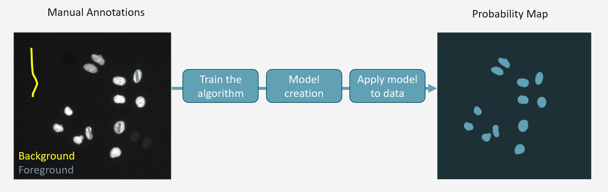
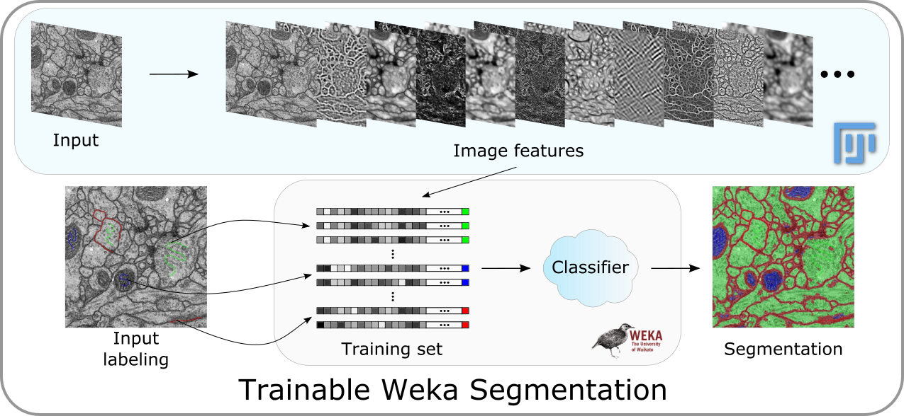

# Machine-learning for image segmentation

### 🎯 Learning Objective

- Explain how supervised machine learning is used for image segmentation.

- Use the Trainable Weka Segmentation plugin in Fiji to train and apply a pixel classifier.

--- 

Machine‑learning–based segmentation teaches a computer to recognize and delineate structures in microscopy images by example rather than by writing explicit rules for 
every possible case. 

In ***supervised learning***, you give the software a handful of images where you’ve already drawn the correct outlines (the “ground truth”).
 The program then figures out which pixel patterns—brightness, texture, edges—match your drawings. After checking that it works on a 
 few test images, it can automatically create masks on new images for you, saving hours of manual tweaking.
 
 Thus the programs learns to discern different cells or structures — much as a student might study example slides showing healthy 
 versus diseased cells to learn what visual cues distinguish them.

Here’s how it works step by step:

- **Feature Extraction:** The algorithm examines each pixel (and its local neighborhood) to compute simple characteristics—intensity, texture, edge responses, or color.

- **Model Training:** Using your labeled examples, the algorithm “learns” which combinations of features correspond to the object class (e.g., cell, nucleus, background). It builds a mathematical model—often a decision tree or a small neural network—that can predict the class of each pixel.

- **Validation:** A separate set of labeled images (the “validation” or “test” set) checks how well the model performs on new data. This helps avoid overfitting (when a model learns the training examples too exactly but fails on unseen images).

- **Prediction:** Once the model is trained and validated, you feed it new, unlabeled images. It applies the learned rules to assign each pixel to a class, producing a segmentation mask automatically.

---

### The Principle behind Pixel Classification

***Pixel classification*** is a specific type of supervised segmentation where each pixel is assigned to a category such as "signal" or "background" 
by evaluating not only its raw intensity but also a suite of engineered features (that capture local texture, edge, and spatial information.

In a typical pixel classification workflow, you:

**1. Select Features:** Choose features and scales that capture the structural and textural cues in your data.

**2. Annotate:** Scribble example regions for each class (signal vs. background).

**3. Train & Refine:** Fit a Random Forest (or similar) to your annotations, inspect the results, then iteratively add or adjust annotations until the segmentation is robust.

**4. Batch‑Apply:** Use the finalized classifier to process all images in your dataset automatically.
 
 

---

### Fiji Plugin for Pixel Classification

- **Trainable Weka Segmentation (Fiji/ImageJ)** 
Leverages the Weka machine‑learning library inside ImageJ. Offers a familiar ImageJ interface with feature selection 
and model training.   
[Trainable Weka Segmentation in Fiji](https://imagej.net/plugins/tws/)

The Trainable Weka Segmentation is a Fiji plugin that combines a collection of machine learning algorithms with a set of selected image 
features to produce pixel-based segmentations. Weka (Waikato Environment for Knowledge Analysis) can itself be called from the plugin. 
It contains a collection of visualization tools and algorithms for data analysis and predictive modeling, together with graphical user interfaces for easy access to this functionality.

