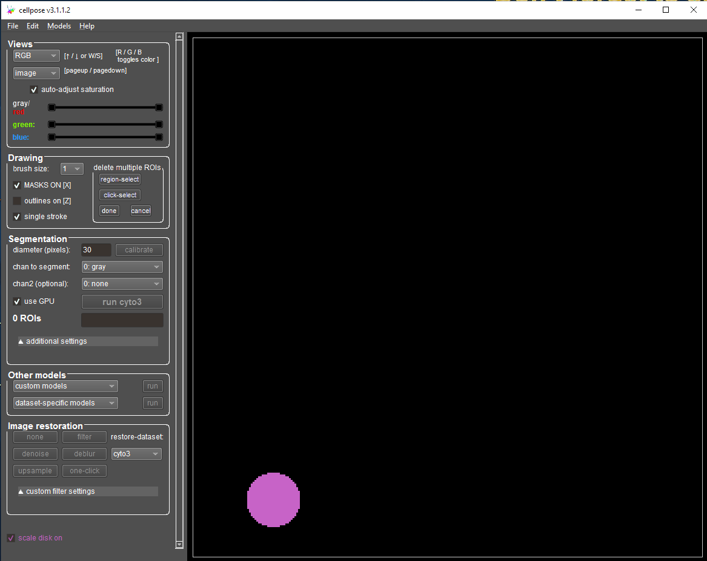

# 🛠️ **Tutorial 5 - Cellpose: Segmenting Difficult Cells**

### **Background Scenario**

You're working with fluorescent microscopy images of touching cells. 
You’ve tried conventional thresholding and watershed segmentation in Fiji or ImageJ
— but the cells are touching, boundaries are unclear, and over- or under-segmentation is a 
common issue.

---

### **Goal:** 
Use **Cellpose** to generate accurate cell masks, separating individual cells, 
even in cluttered images.

---

### 🧭 **Step-by-Step Instructions**

Start Cellpose by clicking on the Cellpose icon on your Desktop.

Your Cellpose GUI should look like this:

---
#### ▶️ Step 1: Load Your Image

* Open your image using `File > Load image (*.tif, *.png, *.jgp)` in the GUI
* Your image should now appear in grayscale or RGB

---

#### ▶️ Step 2: Inspect the Cellpose GUI

You'll find different sections at the left hand side of the Cellpose GUI. 

* **Views** Control of channels, brightness and contrast
* **Drawing**: Selection how to show segmentation and control about manual annotations
* **Segmentation**: Parameters for Cellpose (cyto3) segmentation
* **Other models**: Selection of custom models or other Cellpose models (a.o. nuclei, cyto2)
* **Image restoration**: Performs denoising or filtering before segmentation if enabled
* **Scale disk on**: Size indicator as magenta disk at the lower left side of the image
* You can **Zoom** using the mouse wheel or <kbd>Ctrl</kbd> + <kbd>+</kbd> and <kbd>Ctrl</kbd> + <kbd>-</kbd> 

 

* Toggle the different views and adjust brightness and contrast for your channels.
* Which structures do channel 0 and channel 1 show?

--- 

#### ▶️ Step 3: Apply the pre-trained model (cyto3)

* Set the correct diameter of your cells - you can use a measurement from Fiji, estimate the size using the scale disk or click "Calibrate" to let Cellpose decide
* Select the channels you'd like to segment, "chan2" can be the nuclei channel to support segmentation
* **Flow threshold / cell probability:** Leave default for now
* **Use GPU:** Enable if you have one (optional but faster)

---

#### ▶️ Step 4: Run Segmentation

* Click **“Run cyto3"** or click run next the custom or data-specific models
* You’ll see overlaid segmentation mask
* Use **View** to change the display, e.g. show the segmentation outlines
* Evaluate: Are all cells segmented? Are there missed detections or merged objects?

 

* Compare results between the different **cyto** and **nuclei** models.
* Try adjusting the **diameter** or **flow threshold** — what changes?

---

#### ▶️ Step 5: Refine or Save

* Use the **brush tool** to manually correct any mistakes if needed
* Export masks as:

  * **Label Images**: `File > Save masks as PNG/tif`
  * **ROIs**: `File > Save outlines as .zip archive of ROI files for ImageJ`  

---

### 🧪 **Challenge Exercise**

Try running Cellpose on:

* A brightfield image of adherent cells
* A DAPI-stained image with clustered nuclei
* A tissue section with mixed cell sizes

---

### 📌 **Key Takeaways**

| Pros                       | Cons                                      |
| -------------------------- | ----------------------------------------- |
| Works “out of the box”     | Needs GPU for large images or 3D stacks   |
| Handles crowded cells well | Not ideal for thin, filamentous shapes    |
| Supports brightfield & RGB | May need tuning for unusual imaging types |
| No coding required         | Fine-tuning model requires annotation     |

---

### 🔗 Useful Resources

* [Official Cellpose Tutorial (YouTube)](https://www.youtube.com/watch?v=K1o2YzEYrRc)
* [Cellpose GitHub Page](https://github.com/MouseLand/cellpose)
