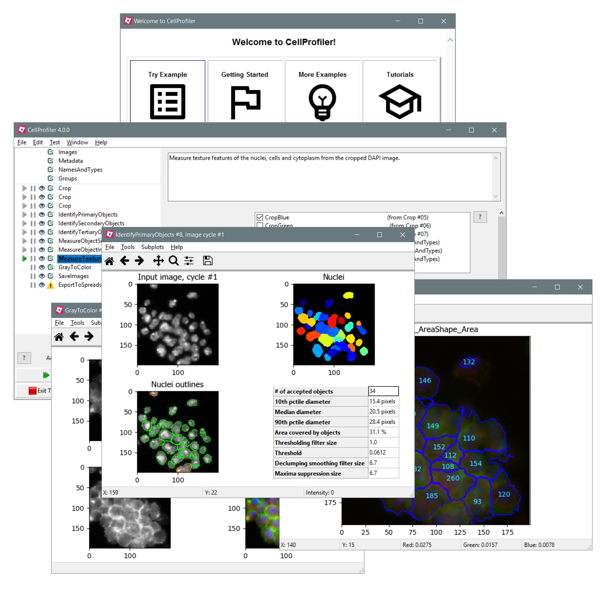

# CellProfiler

 

 
An open-source application designed to automate the quantitative analysis of biological images, 
enabling high-throughput measurement of cell phenotypes through modular pipelines. Its plugin 
architecture and command-line interface support large-scale studies and integration with other 
data analysis workflows.

- Open-source image analysis software for multidimensional imaging data
- Automated end-to-end image analysis pipelines
- Image processing
- 3D Segmentation
- Object Relations
- Image and Object measurements  
 
 

[Official CellProfiler Website](https://cellprofiler.org/) | [GitHub](https://github.com/CellProfiler/CellProfiler)

When using CellProfiler for your image analysis, please cite:
>***CellProfiler 4: improvements in speed, utility and usability.***  
Stirling DR, Swain-Bowden MJ, Lucas AM, Carpenter AE, Cimini BA, Goodman A . 
BMC Bioinformatics (2021)