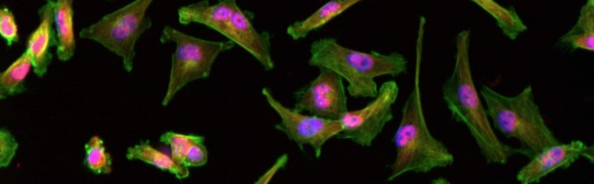

# 🧪 **Hands-On CellProfiler: Creating a reproducible analysis pipeline**

### **Background Scenario**

**© Copyright by Pascual-Vargas et al.** |
[Source](https://idr.openmicroscopy.org/webclient/img_detail/2874783/?well=1246992)

The data we will analysis today, is derived from this research paper: 

>***Analysis of YAP/TAZ localization in triple negative breast cancer in response to Rho GTPase regulators*** <br>
Pascual-Vargas P, Cooper S, Sero J, Bousgouni V, Arias-Garcia M, Bakal C., Scientific Data, 2017

[Publication](https://pmc.ncbi.nlm.nih.gov/articles/PMC5332010/) | [Full Dataset](https://idr.openmicroscopy.org/webclient/?show=screen-1651)


### Research question for today:

**What is the YAP/TAZ ratio between nucleus and cytoplasm?**

Create an image analysis pipeline using CellProfiler to calculate the 
YAP/TAZ ratio between nucleus and the cytoplasm in this dataset.


**Analysis strategy:**

- (Image preprocessing)
- Segment nuclei and cytoplasm
- Assign each cytoplasm one nucleus
- Measure intensity parameters for nucleus and cytoplasm
- Calculate Yap/Taz Ratio
- Export the results


---

### 🧭 Step‑by‑Step Instructions

You can launch CellProfiler on JupyterHub via the **CellProfiler** icon, or on the HIVE using the Anaconda Prompt and type:

```bash
conda activate cellprofiler-cellpose
cellprofiler
```

---

#### 📂 Step 1: Load Your Images

* In CellProfiler’s **“File”** menu, choose **“Import Images”**.
* Use **“Images”** input, click **“Add Folder”**, and select the downloaded dataset directory.
* Verify that your channels appear (e.g., `YAP_TAZ.tif`, `DAPI.tif`).

---

#### 🔖 Step 2: Metadata & Grouping (Optional)

* In **Metadata**, extract image identifiers (e.g., well, field).
* In **NamesAndTypes**, assign channels:

  * **Channel 1:** DAPI → nuclei
  * **Channel 2:** YAP/TAZ → signal of interest

---
- Start test mode

#### 🧹 Step 3: Illumination Correction

* Add module **“CorrectIlluminationCalculate”**

  * Method: **Background**
  * Block size: \~50–100 pixels
* Add **“CorrectIlluminationApply”** to both channels, using the computed correction image.

---

#### ⚪ Step 4: Identify Nuclei

* Add **“RunStardist”** or **RunCellpose"**

  * Input: corrected DAPI
  * Typical diameter: 20–50 pixels
* Review segmentation overlay and adjust diameter or threshold settings until nuclei are well separated.

---

#### 🌐 Step 5: Identify Cell Bodies (Cytoplasm)

* Add **RunCellpose"**

  * Input objects: cytoplasm

---

#### 🔗 Step 6: Relate Objects/Tertiary Object

* Add **“RelateObjects”** to verify each cytoplasm is assigned to its nucleus.

---

#### 📊 Step 7: Measure Intensities

* Add **“MeasureObjectIntensity”**

  * Measure YAP/TAZ channel intensities in both nuclei and cytoplasm objects.

---

#### ➗ Step 8: Compute YAP/TAZ Ratio

* Add **“CalculateMath”**

  * Formula: `MeanIntensity_Nucleus / MeanIntensity_Cytoplasm`
  * Name the output measurement **`YAP_TAZ_ratio`**

---

#### 💾 Step 9: Export Results

* Add **“ExportToSpreadsheet”**

  * Select measurements: `YAP_TAZ_ratio`, object IDs, metadata
  * Choose CSV output path (e.g., `results/YAP_TAZ_ratios.csv`)
* Save your pipeline via **File > Save Project As** (e.g., `YAP_TAZ_pipeline.cpproj`).


---

#### 🔄 Step 10: Analyse your images in Batch‑process

---

### 📌 Key Takeaways

| ✅ Pros                                         | ⚠️ Cons                                                           |
| ---------------------------------------------- | ----------------------------------------------------------------- |
| GUI‑driven, no coding required                 | Initial setup of modules can be time‑intensive                    |
| Fully modular: you see every processing step   | Large pipelines may feel overwhelming at first                    |
| Transparent settings: all parameters are saved | Complex scripts require Python integration                        |
| Batch‑process dozens of images with one click  | Advanced analyses (e.g., machine learning) need plugins or export |

---

### 🔗 Useful Resources

* **CellProfiler Documentation:** [https://cellprofiler.org/docs](https://cellprofiler.org/docs)
* **Example Pipelines Gallery:** [https://cellprofiler.org/examples](https://cellprofiler.org/examples)
* **Video Tutorials:** [https://www.youtube.com/c/CellProfiler](https://www.youtube.com/c/CellProfiler)
* **Discussion Forum:** [https://forum.image.sc](https://forum.image.sc)