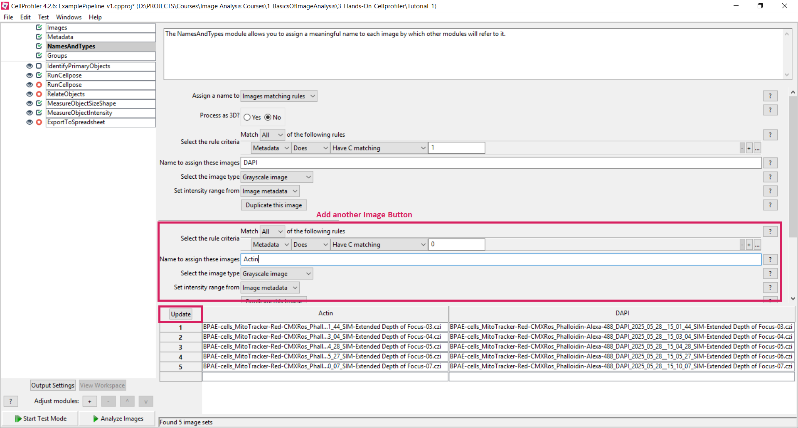

# 🛠 **Hands-On CellProfiler: Creating a reproducible analysis pipeline**

### **Background Scenario**


### Research questions for today

**How many cells do we have per field of view?**
**What is the mean DAPI intensity among all cells?**
**What is the mean area of the nuclei?**


**Analysis strategy:**

1. Segment nuclei
2. Measure the size and shape of the nuclei
3. Measure the DAPI intensity in the nuclei
4. Export the measurements


---

### 🧭 Step‑by‑Step Instructions

Starting CellProfiler:

**JupyterHub**

Click on the **CellProfiler** icon.


**HIVE**

Open the Anaconda Prompt and type: 
```bash
conda activate cellprofiler-cellpose
cellprofiler
```


!!! hint "Getting started .."
	**Open the project:** <br>
	"..\1_BasicsOfImageAnalysis\3_Hands-On_Cellprofiler\ExamplePipeline_v1\ExamplePipeline_v1.cpproj". <br>
	<br>
	***In this examples the first steps are already prepared for you - follow this tutorial for understanding each module in detail.***

---

#### 📂 Step 1: Load Your Images

*PREPARED FOR YOU*

- Right click on the "Drop field" --> "Browse for Folder"
- Select your dataset directory


---

#### 🔖 Step 2: Metadata

*PREPARED FOR YOU*

* In **Metadata**, extract image identifiers.
	- Choose "Extract metadata?": Yes
	- Select "Metadata extraction method": Extract from image file headers
	- Click on "Extract metadata"
	- At the table below, click "Update"


	

---

#### 🧹 Step 3: NamesAndTypes

*PREPARED FOR YOU*

* In **NamesAndTypes**, assign channels:
	- "Assign a name to" : "Images matching rules"
	- Assign "Nuclei" to images containing channel 1 in their metadata. 
	- Click on the Update button to display a table that shows each channel pair matched up for the wells in the assay.


---

Start **Test Mode**

---

#### ⚪ Step 4: Identify Nuclei

*PREPARED FOR YOU*

* Use the **IdentifyPrimaryObjects** module
  - Input image: Select your grayscale image (e.g. "DAPI").
  - Name output objects: e.g. "Nuclei_Segmentation".
  - Typical diameter: Set to 100–400 pixels (adjust based on image).
  
  - Optional: Check out the advanced options and test different thresholds or use smoothing and declumping options to improve separation.


---
#### 📊 Step 5: Measure Sizes and Shapes

*PREPARED FOR YOU*

* Add the **MeasureObjectSizeShape** module.
  * Select the object(s) you want to measure, e.g.: Nuclei_Segmentation


---

#### 📊 Step 6: Measure Intensities

*PREPARED FOR YOU*

* Add **MeasureObjectIntensity**

  * Measure channel intensity in nuclei objects.
  * You need to select the images that you'd like to measure ("DAPI")
  * You also need to select the objects that you'd like to measure ("Nuclei_Segmentation")


---

#### 💾 Step 7: Export Results

*PREPARED FOR YOU*

* Add **ExportToSpreadsheet**

  * Select measurements: `YAP_TAZ_ratio`, object IDs, metadata
  * Choose CSV output path (e.g., `results/YAP_TAZ_ratios.csv`)
  
* Save your pipeline via **File > Save Project As** (e.g., `YAP_TAZ_pipeline.cpproj`).


---

#### 🔄 Step 10: Analyse your images in Batch‑process

* Once your pipeline is finished, you can hit "Analyze Images" and start analysis!

---

#### Exercises

###### 🧰 **Task:** <br>
Inspect the results output for both images and results table.


###### 🧰 **Task:** <br>
Exchange the **IdentifyPrimaryObjects** with the **RunCellPose** module.

**Next Step: Identify Nuclei using Cellpose**

* Add a **RunCellpose** module

  * Select the appropriate detection mode for nuclei
  * Select your input image ("Nuclei")
  * Typical diameter: 100-400 pixels
  * Give a meaningful name to your output object (e.g. "Nuclei_Segmentation")
  * Review segmentation overlay and adjust diameter or threshold settings until nuclei are well separated.

Is this segmentation better or worse than the previous segmentation?


---
###### 🧰 **Task:** <br>
You often have two channels on which you'd like to perform measurements. 
Also, sometimes you need to relate both channels to each other, e.g. each cell has one nucleus. 

 **Next Steps: Identify Cell Bodies (Cytoplasm)**

  First, add the Actin channel to your pipeline by adding it in the **NamesAndTypes** Modules:

  * In **NamesAndTypes**, assign channels:
	- "Assign a name to" : "Images matching rules"
	- Assign "Actin" to images containing channel 0 in their metadata. 
	- Click on the Update button to display a table that shows each channel pair matched up for the wells in the assay.





Segment the Cell Bodies using Cellpose:

* Add a **RunCellpose** module

  * Select the appropriate detection mode for cytoplasm
  * You can include the nucleus channels as second channel
  * Select your input image ("Actin")
  * Typical diameter: 50-80 pixels
  * Give a meaningful name to your output object (e.g. "Cytoplasm_Segmentation")
  * Review segmentation overlay and adjust diameter or threshold settings until nuclei are well separated.


Assign each nucleus one cell:

* Add **RelateObjects** to verify each cytoplasm is assigned to its nucleus.
  * Choose "Cytoplasm_Segmentation" as Parent Object and "Nuclei_Segmentation" as Child Objects
  * Save the children with parents as new object set with a meaningful name (e.g. "Nuclei_Seg_Relate")


  
Perform size, shape and intensity measurments using your existing **MeasureObjectSizeShape** and **MeasureObjectIntensity** modules.

* Add the new objects and channels to the list of things which should be measured.
* In the ExportToSpreadsheet module: add the measurements you'd like to export.

---

###### 🧰 **Task:** <br>
Add another measurement module from the “Measurement” module category and configure it. 
Which modules make sense, which don’t? <br>
You can find more info on the measurements here: https://cellprofiler-manual.s3.amazonaws.com/CellProfiler-4.2.6/modules/measurement.html

---

###### 🧰 **Task:** <br>
The cytoplasm segmentation actually includes the nucleus - what would a better approach be?
Can you subtract the nucleus from the cytoplasm? Which module would you choose?
Hint: Create a tertiary object ...


---

### 📌 Key Takeaways

| ✅ Pros                                         | ⚠️ Cons                                                           |
| ---------------------------------------------- | ----------------------------------------------------------------- |
| GUI‑driven, no coding required                 | Initial setup of modules can be time‑intensive                    |
| Fully modular: you see every processing step   | Large pipelines may feel overwhelming at first                    |
| Transparent settings: all parameters are saved | Complex scripts require Python integration                        |
| Batch‑process dozens of images with one click  | Advanced analyses (e.g., machine learning) need plugins or export |

---

### 🔗 Useful Resources

* **CellProfiler Documentation:** [https://cellprofiler.org/manual](https://cellprofiler-manual.s3.amazonaws.com/CellProfiler-4.2.6/index.html)
* **Example Pipelines Gallery:** [https://cellprofiler.org/examples](https://cellprofiler.org/examples)
* **Video Tutorials:** [https://www.youtube.com/CellProfiler](https://www.youtube.com/playlist?list=PLXSm9cHbSZBBy7JkChB32_e3lURUcT3RL)
* **Discussion Forum:** [https://forum.image.sc](https://forum.image.sc)