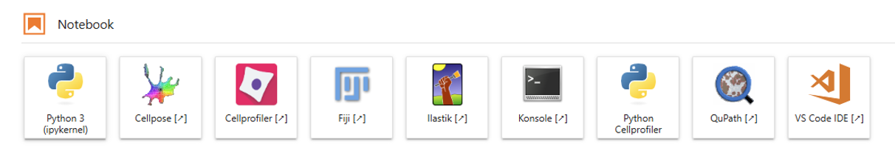

# JupyterHub

The JupyterHub is a service provided by the Central IT (CIT). 
It is an interactive web-based data visualization & analysis and development platform. 
The JuypterHub offers interactive data analysis using different programming languages, including Julia, R and Python.
The MiN offers a "Bioimage Analysis" platform on the Hub for image analysis.

### Available Software on the Bioimage Analysis platform

The following software is available on the Hub:

### Setting up Your JuypterHub

You can find a detailed manual on our [confluence pages](https://confluence.uni-muenster.de/spaces/WWUIMW/pages/92414286/JupyterHub). 

1. Start your JupyterHub on [JupyterHub](https://jupyterhub.uni-muenster.de/). 
2. Configure your environment
3. Launch your server
4. Connect the course data:
	1. Go to the terminal
	2. Type: ln -s Path-to-coursedata
	3. Press Enter
	

